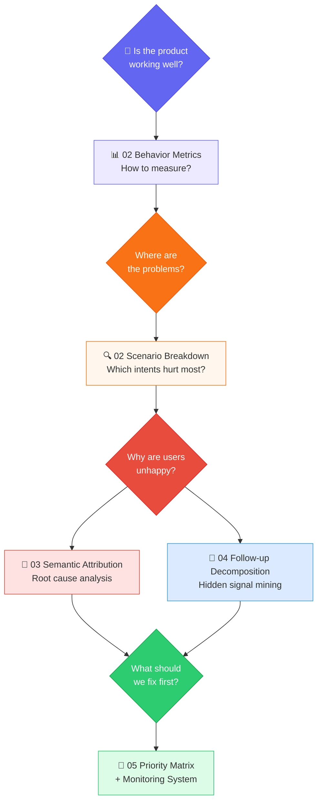
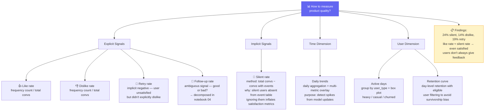
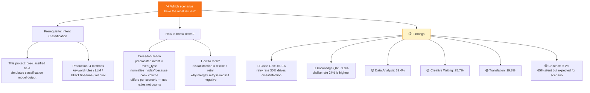
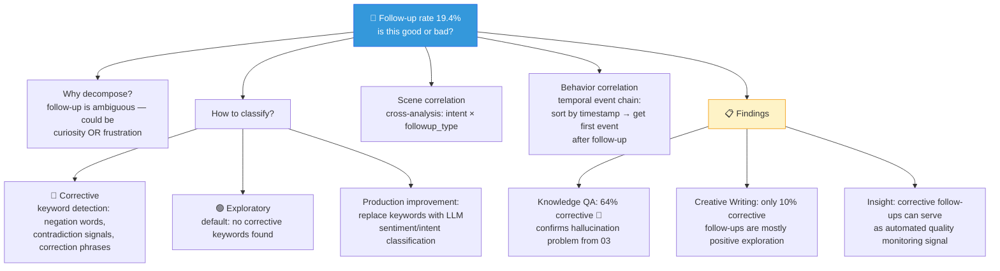
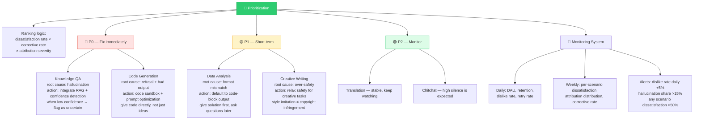

[📖 中文版文档](README_CN.md)

# 🤖 AI Chat Analytics

> A complete user behavior analytics pipeline for conversational AI products, from raw event data to actionable product insights.

## 🎯 What is This?

If you build a ChatGPT/Claude-like product, your users will chat, like 👍, dislike 👎, retry 🔄, and follow up 💬 — or just leave silently 🤐. **How do you turn these signals into product decisions?**

This project demonstrates a full analytics framework that answers:

- 📊 **How is overall quality?** — Behavior distributions, satisfaction rates
- 🔍 **Where are the problems?** — Per-scenario quality breakdown
- ❓ **Why are users unhappy?** — Semantic root-cause attribution
- 💬 **What do follow-ups really mean?** — Exploratory vs. corrective signal decomposition
- 🎯 **What should we fix first?** — Prioritized optimization recommendations

---

## 🧠 Thinking Chain & Tree

### Overview



### Branch 1 — "Is the product working well?" → Behavior Metrics



### Branch 2 — "Where are the problems?" → Scenario Breakdown



### Branch 3 — "Why are users unhappy?" → Semantic Attribution

```mermaid
graph TD
    ROOT["🔬 Root cause analysis<br/>for 7,363 bad cases"]

    ROOT --> TAXONOMY["Attribution Taxonomy — 5 categories"]
    TAXONOMY --> T1["🟥 Hallucination<br/>fabricated facts / people / papers"]
    TAXONOMY --> T2["🟧 Off-topic<br/>misunderstood user intent"]
    TAXONOMY --> T3["🟪 Refusal<br/>over-safety, refused answerable questions"]
    TAXONOMY --> T4["🟩 Format mismatch<br/>wanted code, got text explanation"]
    TAXONOMY --> T5["📘 Quality insufficient<br/>right direction but too vague — catch-all"]

    ROOT --> PATHA["Path A: Keyword Rules<br/>+ Manual Review"]
    PATHA --> PA1["Step 1: Priority rule chain<br/>refusal keywords → hallucination signals<br/>→ format check → off-topic signals<br/>→ fallback: quality insufficient"]
    PATHA --> PA2["Step 2: Manual review<br/>export CSV → annotator checks rule output<br/>focus: reclassify catch-all cases<br/>QC: dual annotation + Cohen's Kappa"]
    PATHA --> PA3["Limitation: 71% falls to catch-all<br/>translation and chitchat: 100% catch-all"]

    ROOT --> PATHB["Path B: LLM Auto-labeling"]
    PATHB --> PB1["Method: zero-shot prompt classification<br/>input: query + response → prompt template<br/>→ returns attribution category"]
    PATHB --> PB2["Model: gpt-4o-mini<br/>temperature=0 for reproducibility"]
    PATHB --> PB3["Validation: use Path A manual<br/>labels as golden set"]

    ROOT --> FINDING["📋 Findings"]
    FINDING --> F1["Knowledge QA → hallucination 22%"]
    FINDING --> F2["Data Analysis → format mismatch 65%"]
    FINDING --> F3["Creative Writing → refusal 23%"]
    FINDING --> F4["Code Gen → refusal 12% + format 13%"]

    style ROOT fill:#e74c3c,stroke:#dc2626,color:#fff
    style FINDING fill:#fef3c7,stroke:#f39c12,color:#333
```



### Branch 4 — "Are follow-ups good or bad?" → Signal Decomposition



### Branch 5 — "What should we fix first?" → Priority Matrix



---

## 📁 Project Structure

```
ai-chat-analytics/
├── README.md                          # English (default)
├── README_CN.md                       # 中文版
├── requirements.txt
├── data/
│   ├── users.csv                      # 500 simulated users
│   ├── conversations.csv              # ~22K conversations
│   └── events.csv                     # ~20K behavioral events
├── notebooks/
│   ├── 01_data_generation.ipynb       # Synthetic data with realistic patterns
│   ├── 02_behavior_analysis.ipynb     # Multi-dimensional behavior metrics
│   ├── 03_semantic_attribution.ipynb  # Bad case root-cause analysis
│   ├── 04_followup_signal.ipynb       # Follow-up type decomposition
│   └── 05_insights_summary.ipynb      # Actionable recommendations
├── src/
│   └── utils.py                       # Shared utilities
└── output/
    └── bad_cases_for_labeling.csv     # Exported for manual annotation
```

## ⚡ Quick Start

```bash
# Clone
git clone https://github.com/gh59/ai-chat-analytics.git
cd ai-chat-analytics

# Install dependencies
pip install -r requirements.txt

# Run notebooks in order
cd notebooks
jupyter notebook 01_data_generation.ipynb
```

## 📦 Requirements

```
pandas
numpy
plotly
jupyter
```

## 🧩 Design Philosophy

1. **No pre-labeled data** — Intent classification and attribution labels are NOT baked into synthetic data. The pipeline demonstrates how to derive them, matching real-world conditions.

2. **Event stream, not single labels** — One conversation can trigger multiple events (retry → like). This mirrors real product instrumentation.

3. **Silence is data** — 24% of conversations have zero feedback. Ignoring them biases your quality metrics upward.

4. **Follow-ups are ambiguous** — A high follow-up rate could mean high engagement OR high frustration. You must decompose before interpreting.

5. **Attribution needs multiple paths** — Keyword rules are fast but shallow; LLM labeling is smart but costly; manual labeling is accurate but unscalable. A production system needs all three.
