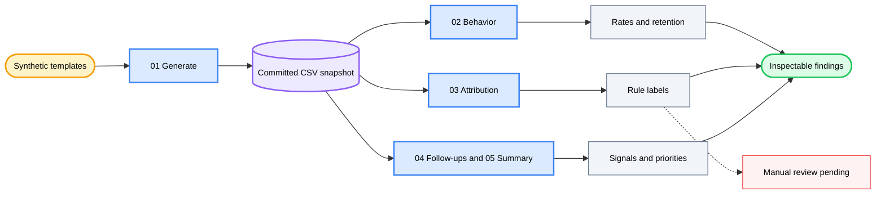

<div align="center">

# 💬 AI Chat Analytics

### *Turn synthetic conversation events into inspectable product-quality findings.*

[](LICENSE) [](notebooks/01_data_generation.ipynb) [](notebooks) [](#data-and-privacy) [](https://github.com/okht/ai-chat-analytics)

[](data/users.csv) [](data/conversations.csv) [](data/events.csv) [](#data-and-privacy)

<br>

<table>
<tr><td align="left">

📭 &nbsp;5,394 silent conversations disappear when analysis starts from events alone.<br>
🔀 &nbsp;Retries and follow-ups carry different meanings across six intent scenarios.<br>
🔎 &nbsp;71.2% of rule-labeled bad cases fall into one catch-all quality bucket.

</td></tr>
</table>

### ✨ Link behavior metrics, rule-based attribution, follow-up signals, and prioritization to one committed synthetic snapshot.

**Synthetic templates → committed CSV snapshot → behavior, attribution, and follow-up analyses → product priorities**

<br>

[📊 Snapshot](#snapshot) · [🧭 Analysis tracks](#analysis-tracks) · [📈 Results](#results) · [🗺️ Workflow](#workflow) · [🚀 Reproduce](#reproduce) · [🔬 Methodology](#methodology) · [🔐 Data & privacy](#data-and-privacy) · [🧪 Verification](#verification) · [📁 Structure](#project-structure) · [📌 Limitations](#limitations) · [📝 Notes](#notes)

[**English**](README.md) · [**简体中文**](README_CN.md) · [**Español**](README_ES.md) · [**Deutsch**](README_DE.md) · [**日本語**](README_JA.md) · [**Русский**](README_RU.md) · [**Português**](README_PT.md) · [**한국어**](README_KO.md)

</div>

---

<a id="snapshot"></a>
## 📊 Snapshot

AI Chat Analytics is a five-notebook research example for studying product signals in conversational AI. The committed snapshot is generated from fixed templates with NumPy and Python random seeds set to `42`.

| Dataset | Rows | Scope |
|---|---:|---|
| **Users** | 500 | Anonymous synthetic IDs across heavy, casual, and churned cohorts |
| **Conversations** | 22,394 | Six preassigned intent scenarios from 2025-03-01 through 2025-03-31 |
| **Events** | 19,952 | Like, dislike, retry, and follow-up events |
| **Bad cases** | 7,363 | Conversations whose first event is dislike or retry |

The snapshot contains 5,394 conversations with no event. Those silent conversations account for 24.1% of all conversations and remain part of the denominator.

---

<a id="analysis-tracks"></a>
## 🧭 Analysis tracks

| Notebook | Question | Method | Current artifact |
|---|---|---|---|
| **01 · Data generation** | What can be studied without private product data? | Seeded templates, user cohorts, scenario-specific event probabilities | Three committed CSV files |
| **02 · Behavior analysis** | What does the first observed behavior show? | Event distribution, scenario cross-tabs, activity, retention, and daily trends | Notebook code; no saved execution output |
| **03 · Semantic attribution** | Why do dislike and retry cases occur? | Five-label keyword rules plus a pending manual-review column | `output/bad_cases_for_labeling.csv` |
| **04 · Follow-up signals** | Which follow-ups look corrective? | Keyword split and scenario comparison | Notebook code; no saved execution output |
| **05 · Insights summary** | Which scenarios appear most urgent in this snapshot? | Recomputed metrics and priority cards | Notebook code; no saved execution output |

The optional LLM attribution path in notebook 03 is an unexecuted template. The committed repository contains no LLM-generated labels.

---

<a id="results"></a>
## 📈 Results from the committed snapshot

The following values were recalculated directly from the committed CSV files.

### First-event distribution

| First behavior | Conversations | Share |
|---|---:|---:|
| **Like** | 5,302 | 23.7% |
| **Dislike** | 3,165 | 14.1% |
| **Retry** | 4,198 | 18.7% |
| **Follow-up** | 4,335 | 19.4% |
| **Silent** | 5,394 | 24.1% |

### Scenario view

`Dissatisfaction = dislike share + retry share`, using the first event for each conversation.

| Scenario | Conversations | Dissatisfaction |
|---|---:|---:|
| **Code generation** | 5,615 | 45.1% |
| **Data analysis** | 2,264 | 39.4% |
| **Knowledge Q&A** | 5,602 | 39.3% |
| **Creative writing** | 3,325 | 25.7% |
| **Translation** | 3,354 | 19.8% |
| **Chitchat** | 2,234 | 9.8% |

### Rule attribution and follow-ups

| Finding | Value | Interpretation boundary |
|---|---:|---|
| **Catch-all quality label** | 71.2% | Rule coverage is limited; this is not a validated root-cause rate |
| **Format mismatch** | 12.4% | Rule-assigned share of 7,363 bad cases |
| **Refusal** | 6.8% | Rule-assigned share of 7,363 bad cases |
| **Hallucination** | 6.7% | Rule-assigned share of 7,363 bad cases |
| **Corrective follow-ups** | 40.2% | Keyword-classified share of 4,335 follow-up events |
| **Knowledge Q&A corrective share** | 63.5% | Scenario-specific keyword result |

All 7,363 rows have a rule label. The `attribution_manual` column remains empty for every row.

---

<a id="workflow"></a>
## 🗺️ Workflow


```mermaid
flowchart LR
    A([Synthetic templates]) --> B[01 Generate] --> C[(Committed CSV snapshot)]

    C --> D[02 Behavior] --> E[Rates and retention] --> L([Inspectable findings])
    C --> F[03 Attribution] --> G[Rule labels] --> L
    G -.-> H[Manual review pending]
    C --> I[04 Follow-ups and 05 Summary] --> J[Signals and priorities] --> L

    style A fill:#FEF3C7,stroke:#F59E0B,stroke-width:2px,color:#000,font-size:12px
    style B fill:#DBEAFE,stroke:#3B82F6,stroke-width:2px,color:#000,font-size:12px
    style C fill:#EDE9FE,stroke:#8B5CF6,stroke-width:2px,color:#000,font-size:12px
    style D fill:#DBEAFE,stroke:#3B82F6,stroke-width:2px,color:#000,font-size:12px
    style E fill:#F1F5F9,stroke:#64748B,stroke-width:1px,color:#000,font-size:12px
    style F fill:#DBEAFE,stroke:#3B82F6,stroke-width:2px,color:#000,font-size:12px
    style G fill:#F1F5F9,stroke:#64748B,stroke-width:1px,color:#000,font-size:12px
    style H fill:#FEF2F2,stroke:#EF4444,stroke-width:1px,color:#000,font-size:12px
    style I fill:#DBEAFE,stroke:#3B82F6,stroke-width:2px,color:#000,font-size:12px
    style J fill:#F1F5F9,stroke:#64748B,stroke-width:1px,color:#000,font-size:12px
    style L fill:#DCFCE7,stroke:#22C55E,stroke-width:2px,color:#000,font-size:12px
```

Notebook 05 reads the committed CSV files directly and recomputes its summary. It does not consume saved outputs from notebooks 02–04.

---

<a id="reproduce"></a>
## 🚀 Reproduce

Clone the repository and install the dependencies explicitly. The tracked `requirements.txt` is currently empty.

```powershell
git clone https://github.com/okht/ai-chat-analytics.git
cd ai-chat-analytics

python -m venv .venv
# Activate the environment for your shell, then run:
python -m pip install pandas numpy plotly jupyter
```

Open Jupyter from the `notebooks` directory because the notebooks use relative paths such as `../data` and `../output`.

```powershell
cd notebooks
jupyter notebook
```

Run the notebooks in this order:

1. `01_data_generation.ipynb`
2. `02_behavior_analysis.ipynb`
3. `03_semantic_attribution_analysis.ipynb`
4. `04_follow_up_signal_analysis.ipynb`
5. `05_insights_summary.ipynb`

> 📌 Run the full sequence in a fresh clone when comparing results. Notebook 01 rewrites the committed files in `data/`, and notebook 03 rewrites `output/bad_cases_for_labeling.csv`.

The core path requires no OpenAI key. Notebook 03 also contains an optional, commented LLM-labeling template; enabling it requires a separately configured SDK and credential.

---

<a id="methodology"></a>
## 🔬 Methodology

| Stage | Current rule | Consequence |
|---|---|---|
| **Intent** | One of six intent labels is assigned during synthetic generation | Intent classification accuracy is outside this repository's evidence |
| **Primary behavior** | The earliest event becomes the conversation's primary behavior | Later events remain available but do not define the headline rates |
| **Silence** | A conversation with no event is counted as silent | Event-only analysis would omit 5,394 conversations |
| **Bad case** | The first event is dislike or retry | The committed bad-case set contains 7,363 conversations |
| **Dissatisfaction** | Dislike share plus retry share | This is a project-defined diagnostic metric |
| **Attribution** | Ordered keyword rules assign one of five labels | 71.2% reaches the catch-all quality label |
| **Follow-up type** | Corrective keywords split follow-ups from the exploratory default | The split reflects the templates and rules in this snapshot |

The rule labels are pre-annotations for review. They have not been validated against human labels or an LLM-generated golden set.

---

<a id="data-and-privacy"></a>
## 🔐 Data and privacy

| File | Fields | Public-data role |
|---|---|---|
| **`data/users.csv`** | Synthetic ID, cohort, signup date | Anonymous user fixture |
| **`data/conversations.csv`** | Conversation, user, session, time, intent, query, response | Template-generated conversation fixture |
| **`data/events.csv`** | Event, conversation, type, time, follow-up text | Template-generated event stream |
| **`output/bad_cases_for_labeling.csv`** | Bad case, rule label, empty manual label | Review worksheet generated by notebook 03 |

- No real user data, account identifiers, emails, or private product logs are included.
- The synthetic IDs do not connect to ChatGPT, Claude, or any other service account.
- The core notebook path reads local CSV files and makes no network request.
- The `sk-xxx` text in notebook 03 is a placeholder inside an unexecuted optional template.
- Adapting this workflow to real product data requires a separate privacy, consent, retention, and access-control review.

---

<a id="verification"></a>
## 🧪 Verification

| Check | Current evidence |
|---|---|
| **Notebook syntax** | All 29 code cells parse as Python |
| **Saved execution state** | Notebook 01 has saved outputs; notebooks 02–05 do not |
| **Primary keys** | User, conversation, and event IDs are unique |
| **References** | Every conversation user and event conversation resolves |
| **Event timing** | No event precedes its conversation timestamp |
| **Manual labels** | 0 of 7,363 rows completed |
| **Automated tests** | No automated test suite is included |

The result tables in this README were checked against the committed CSV snapshot. They do not represent a production benchmark.

---

<a id="project-structure"></a>
## 📁 Project structure

```text
ai-chat-analytics/
├── README.md
├── README_CN.md
├── README_ES.md
├── README_DE.md
├── README_JA.md
├── README_RU.md
├── README_PT.md
├── README_KO.md
├── LICENSE
├── requirements.txt                  # currently empty
├── data/
│   ├── users.csv
│   ├── conversations.csv
│   └── events.csv
├── notebooks/
│   ├── 01_data_generation.ipynb
│   ├── 02_behavior_analysis.ipynb
│   ├── 03_semantic_attribution_analysis.ipynb
│   ├── 04_follow_up_signal_analysis.ipynb
│   └── 05_insights_summary.ipynb
├── output/
│   └── bad_cases_for_labeling.csv
└── src/
    └── utils.py                      # currently empty
```

---

<a id="limitations"></a>
## 📌 Limitations

- Every committed row is synthetic; real-user behavior may differ materially.
- Intent labels are assigned during data generation and do not evaluate an intent classifier.
- Dependencies are not pinned, and `requirements.txt` is empty.
- `src/utils.py` is empty; the notebooks contain the active analysis code.
- Notebooks 02–05 have no saved execution outputs in the committed snapshot.
- The manual-label column is empty, so rule-attribution accuracy is unknown.
- The optional LLM path is an unexecuted template and has no committed result.
- No automated tests, CI workflow, release, or compatibility matrix is included.

---

<a id="notes"></a>
## 📝 Notes

Use the committed findings as an inspectable example of metric construction and analysis boundaries. Revalidate every assumption before adapting the workflow to another dataset.

Issues and pull requests are welcome.

---

<div align="center">

**Keep every product recommendation traceable to its data and assumptions.**

<br>

MIT License · Maintained by [okht](https://github.com/okht)

</div>
