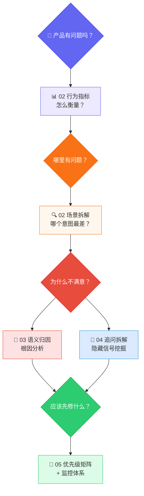
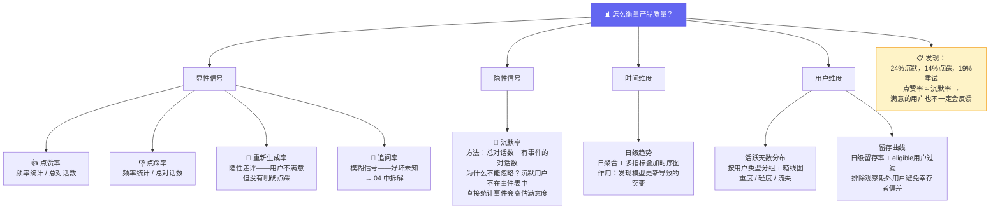
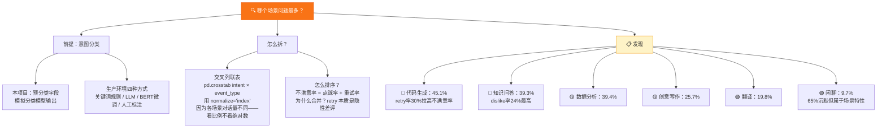
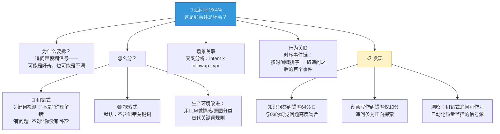
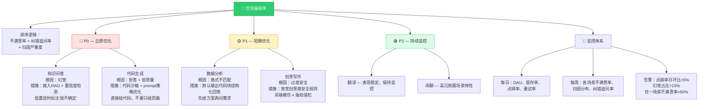

[📖 English Version](README.md)

# 🤖 AI Chat Analytics

> 一套完整的对话式AI产品用户行为分析流水线，从原始事件数据到可执行的产品优化建议。

## 🎯 这是什么？

如果你做了一个类似 ChatGPT/Claude 的产品，用户会聊天、点赞 👍、点踩 👎、重新生成 🔄、追问 💬 —— 或者什么都不做就走了 🤐。**怎么把这些信号变成产品决策？**

本项目展示了一套完整的分析框架：

- 📊 **整体表现如何？** — 行为分布、满意度指标
- 🔍 **哪里有问题？** — 按意图场景拆解质量指标
- ❓ **为什么不满意？** — 语义归因分析，定位根因
- 💬 **追问到底是好事还是坏事？** — 探索式 vs 纠错式信号拆解
- 🎯 **应该优先修什么？** — 优先级排序 + 可执行建议

---

## 🧠 分析思维链与思维树

### 总览



### 分支一 — "产品有问题吗？" → 行为指标体系



### 分支二 — "哪里有问题？" → 场景拆解



### 分支三 — "为什么不满意？" → 语义归因

```mermaid
graph TD
    ROOT["🔬 对7,363条bad case<br/>做根因分析"]

    ROOT --> TAXONOMY["归因体系 — 5个类别"]
    TAXONOMY --> T1["🟥 幻觉<br/>编造事实 / 人物 / 论文"]
    TAXONOMY --> T2["🟧 答非所问<br/>理解偏差，回答方向偏离"]
    TAXONOMY --> T3["🟪 拒绝回答<br/>过度安全策略，该答不答"]
    TAXONOMY --> T4["🟩 格式不匹配<br/>要代码给了文字说明"]
    TAXONOMY --> T5["📘 质量不足<br/>方向对但太笼统——兜底类"]

    ROOT --> PATHA["路径A：关键词规则<br/>+ 人工校验"]
    PATHA --> PA1["第一步：优先级规则链<br/>拒答关键词 → 幻觉信号<br/>→ 格式检查 → 答非所问信号<br/>→ 兜底：质量不足"]
    PATHA --> PA2["第二步：人工校验<br/>导出csv → 标注员检查规则结果<br/>重点：被兜底的case是否有更具体归因<br/>质量控制：双人标注 + Cohen's Kappa"]
    PATHA --> PA3["局限：71%兜底到质量不足<br/>翻译和闲聊100%兜底"]

    ROOT --> PATHB["路径B：LLM自动打标"]
    PATHB --> PB1["方法：zero-shot prompt分类<br/>输入：query + response → prompt模板<br/>→ 返回归因类别"]
    PATHB --> PB2["模型：gpt-4o-mini<br/>temperature=0 确保结果可复现"]
    PATHB --> PB3["校验：用路径A的人工标注<br/>作为golden set评估准确率"]

    ROOT --> FINDING["📋 发现"]
    FINDING --> F1["知识问答 → 幻觉22%"]
    FINDING --> F2["数据分析 → 格式不匹配65%"]
    FINDING --> F3["创意写作 → 拒绝回答23%"]
    FINDING --> F4["代码生成 → 拒答12% + 格式13%"]

    style ROOT fill:#e74c3c,stroke:#dc2626,color:#fff
    style FINDING fill:#fef3c7,stroke:#f39c12,color:#333
```



### 分支四 — "追问是好事还是坏事？" → 信号拆解



### 分支五 — "应该先修什么？" → 优先级矩阵



---

## 📁 项目结构

```
ai-chat-analytics/
├── README.md                          # English (default)
├── README_CN.md                       # 中文版
├── requirements.txt
├── data/
│   ├── users.csv                      # 500 名模拟用户
│   ├── conversations.csv              # ~22K 条对话
│   └── events.csv                     # ~20K 条行为事件
├── notebooks/
│   ├── 01_data_generation.ipynb       # 合成数据生成
│   ├── 02_behavior_analysis.ipynb     # 多维行为指标分析
│   ├── 03_semantic_attribution.ipynb  # Bad case 归因分析
│   ├── 04_followup_signal.ipynb       # 追问信号拆解
│   └── 05_insights_summary.ipynb      # 洞察汇总与产品建议
├── src/
│   └── utils.py                       # 公共工具函数
└── output/
    └── bad_cases_for_labeling.csv     # 导出供人工标注
```

## ⚡ 快速开始

```bash
# 克隆仓库
git clone https://github.com/gh59/ai-chat-analytics.git
cd ai-chat-analytics

# 安装依赖
pip install -r requirements.txt

# 按顺序运行 notebook
cd notebooks
jupyter notebook 01_data_generation.ipynb
```

## 📦 依赖

```
pandas
numpy
plotly
jupyter
```

## 🧩 设计理念

1. **不预打标签** — 意图分类和归因标签不内置在合成数据中，流水线展示的是如何从原始数据中推导，贴近真实场景。

2. **事件流模型** — 一条对话可以触发多个事件（先重试再点赞），而不是简单的一对一标签。

3. **沉默即数据** — 24%的对话没有任何反馈。忽略它们会让你的质量指标虚高。

4. **追问是模糊信号** — 高追问率可能意味着高参与度，也可能意味着高挫败感。必须拆分后才能解读。

5. **归因需要多条路径** — 关键词规则快但浅，LLM打标准但贵，人工标注精但慢。生产系统三者缺一不可。
