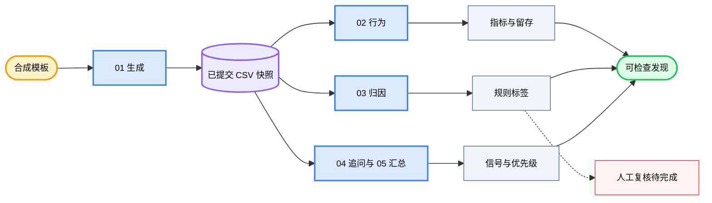

<div align="center">

# 💬 AI Chat Analytics

### *把合成对话事件转化为可检查的产品质量发现。*

[](LICENSE) [](notebooks/01_data_generation.ipynb) [](notebooks) [](#data-and-privacy) [](https://github.com/okht/ai-chat-analytics)

[](data/users.csv) [](data/conversations.csv) [](data/events.csv) [](#data-and-privacy)

<br>

<table>
<tr><td align="left">

📭 &nbsp;只从事件表开始分析会遗漏 5,394 条沉默对话。<br>
🔀 &nbsp;重试与追问在六类意图场景中承载着不同含义。<br>
🔎 &nbsp;71.2% 的规则标注 bad case 落入同一个质量兜底类别。

</td></tr>
</table>

### ✨ 把行为指标、规则归因、追问信号和优先级判断连接到同一份已提交的合成快照。

**合成模板 → 已提交的 CSV 快照 → 行为、归因与追问分析 → 产品优先级**

<br>

[📊 快照](#snapshot) · [🧭 分析路径](#analysis-tracks) · [📈 结果](#results) · [🗺️ 工作流](#workflow) · [🚀 复现](#reproduce) · [🔬 方法](#methodology) · [🔐 数据与隐私](#data-and-privacy) · [🧪 验证](#verification) · [📁 结构](#project-structure) · [📌 局限](#limitations) · [📝 说明](#notes)

[**English**](README.md) · [**简体中文**](README_CN.md) · [**Español**](README_ES.md) · [**Deutsch**](README_DE.md) · [**日本語**](README_JA.md) · [**Русский**](README_RU.md) · [**Português**](README_PT.md) · [**한국어**](README_KO.md)

</div>

---

<a id="snapshot"></a>
## 📊 快照

AI Chat Analytics 是一个包含五份 Notebook 的研究示例，用于分析对话式 AI 产品信号。已提交的数据快照由固定模板生成，NumPy 与 Python 的随机种子都设为 `42`。

| 数据集 | 行数 | 范围 |
|---|---:|---|
| **用户** | 500 | 重度、轻度和流失用户群中的匿名合成 ID |
| **对话** | 22,394 | 2025-03-01 至 2025-03-31 的六类预置意图场景 |
| **事件** | 19,952 | 点赞、点踩、重试和追问事件 |
| **Bad cases** | 7,363 | 首个事件为点踩或重试的对话 |

快照中有 5,394 条对话没有事件，占全部对话的 24.1%。计算总比例时仍将这些沉默对话纳入分母。

---

<a id="analysis-tracks"></a>
## 🧭 分析路径

| Notebook | 问题 | 方法 | 当前产物 |
|---|---|---|---|
| **01 · 数据生成** | 没有私人产品数据时可以研究什么？ | 固定随机种子的模板、用户群和场景事件概率 | 三份已提交的 CSV 文件 |
| **02 · 行为分析** | 首个观察行为呈现了什么？ | 事件分布、场景交叉表、活跃度、留存和日趋势 | Notebook 代码；没有已保存执行输出 |
| **03 · 语义归因** | 点踩和重试为何发生？ | 五类关键词规则与待完成人工复核列 | `output/bad_cases_for_labeling.csv` |
| **04 · 追问信号** | 哪些追问更像纠错？ | 关键词二分与场景比较 | Notebook 代码；没有已保存执行输出 |
| **05 · 洞察汇总** | 这份快照中哪些场景更紧急？ | 重新计算指标并生成优先级卡片 | Notebook 代码；没有已保存执行输出 |

Notebook 03 中的可选 LLM 归因路径是一段未执行模板。已提交仓库中没有 LLM 生成的标签。

---

<a id="results"></a>
## 📈 已提交快照的结果

以下数值直接从已提交的 CSV 文件重新计算得到。

### 首个事件分布

| 首个行为 | 对话数 | 占比 |
|---|---:|---:|
| **点赞** | 5,302 | 23.7% |
| **点踩** | 3,165 | 14.1% |
| **重试** | 4,198 | 18.7% |
| **追问** | 4,335 | 19.4% |
| **沉默** | 5,394 | 24.1% |

### 场景视图

`不满意率 = 点踩占比 + 重试占比`，每条对话均使用首个事件。

| 场景 | 对话数 | 不满意率 |
|---|---:|---:|
| **代码生成** | 5,615 | 45.1% |
| **数据分析** | 2,264 | 39.4% |
| **知识问答** | 5,602 | 39.3% |
| **创意写作** | 3,325 | 25.7% |
| **翻译** | 3,354 | 19.8% |
| **闲聊** | 2,234 | 9.8% |

### 规则归因与追问

| 发现 | 数值 | 解释边界 |
|---|---:|---|
| **质量兜底标签** | 71.2% | 规则覆盖有限；该值不代表经过验证的根因比例 |
| **格式不匹配** | 12.4% | 7,363 条 bad case 的规则分配占比 |
| **拒绝回答** | 6.8% | 7,363 条 bad case 的规则分配占比 |
| **幻觉** | 6.7% | 7,363 条 bad case 的规则分配占比 |
| **纠错式追问** | 40.2% | 4,335 个追问事件中的关键词分类占比 |
| **知识问答纠错占比** | 63.5% | 特定场景的关键词结果 |

全部 7,363 行都有规则标签，`attribution_manual` 列每一行仍为空。

---

<a id="workflow"></a>
## 🗺️ 工作流


```mermaid
flowchart LR
    A([合成模板]) --> B[01 生成] --> C[(已提交 CSV 快照)]

    C --> D[02 行为] --> E[指标与留存] --> L([可检查发现])
    C --> F[03 归因] --> G[规则标签] --> L
    G -.-> H[人工复核待完成]
    C --> I[04 追问与 05 汇总] --> J[信号与优先级] --> L

    style A fill:#FEF3C7,stroke:#F59E0B,stroke-width:2px,color:#000,font-size:12px
    style B fill:#DBEAFE,stroke:#3B82F6,stroke-width:2px,color:#000,font-size:12px
    style C fill:#EDE9FE,stroke:#8B5CF6,stroke-width:2px,color:#000,font-size:12px
    style D fill:#DBEAFE,stroke:#3B82F6,stroke-width:2px,color:#000,font-size:12px
    style E fill:#F1F5F9,stroke:#64748B,stroke-width:1px,color:#000,font-size:12px
    style F fill:#DBEAFE,stroke:#3B82F6,stroke-width:2px,color:#000,font-size:12px
    style G fill:#F1F5F9,stroke:#64748B,stroke-width:1px,color:#000,font-size:12px
    style H fill:#FEF2F2,stroke:#EF4444,stroke-width:1px,color:#000,font-size:12px
    style I fill:#DBEAFE,stroke:#3B82F6,stroke-width:2px,color:#000,font-size:12px
    style J fill:#F1F5F9,stroke:#64748B,stroke-width:1px,color:#000,font-size:12px
    style L fill:#DCFCE7,stroke:#22C55E,stroke-width:2px,color:#000,font-size:12px
```

Notebook 05 直接读取已提交的 CSV 文件并重新计算汇总，没有使用 Notebook 02–04 的已保存输出。

---

<a id="reproduce"></a>
## 🚀 复现

克隆仓库并显式安装依赖。当前已跟踪的 `requirements.txt` 为空。

```powershell
git clone https://github.com/okht/ai-chat-analytics.git
cd ai-chat-analytics

python -m venv .venv
# Activate the environment for your shell, then run:
python -m pip install pandas numpy plotly jupyter
```

请从 `notebooks` 目录打开 Jupyter，因为 Notebook 使用了 `../data` 和 `../output` 等相对路径。

```powershell
cd notebooks
jupyter notebook
```

按以下顺序运行：

1. `01_data_generation.ipynb`
2. `02_behavior_analysis.ipynb`
3. `03_semantic_attribution_analysis.ipynb`
4. `04_follow_up_signal_analysis.ipynb`
5. `05_insights_summary.ipynb`

> 📌 比较结果时请在新克隆副本中运行完整序列。Notebook 01 会重写 `data/` 中已提交的文件，Notebook 03 会重写 `output/bad_cases_for_labeling.csv`。

核心路径无需 OpenAI key。Notebook 03 还包含一段已注释的可选 LLM 标注模板；启用前需要单独配置 SDK 与凭据。

---

<a id="methodology"></a>
## 🔬 方法

| 阶段 | 当前规则 | 影响 |
|---|---|---|
| **意图** | 合成生成时直接分配六类意图之一 | 仓库没有提供意图分类准确率证据 |
| **主行为** | 时间最早的事件成为对话主行为 | 后续事件仍保留，但不参与首要比例定义 |
| **沉默** | 没有事件的对话计为沉默 | 仅分析事件会遗漏 5,394 条对话 |
| **Bad case** | 首个事件为点踩或重试 | 已提交 bad-case 集含 7,363 条对话 |
| **不满意率** | 点踩占比加重试占比 | 这是本项目定义的诊断指标 |
| **归因** | 按顺序执行关键词规则并分配五类标签 | 71.2% 进入质量兜底类别 |
| **追问类型** | 纠错关键词与默认探索式构成二分 | 该划分反映当前快照中的模板和规则 |

规则标签用于人工复核前的预标注。目前尚未使用人工标签或 LLM 生成的 golden set 完成验证。

---

<a id="data-and-privacy"></a>
## 🔐 数据与隐私

| 文件 | 字段 | 公开数据用途 |
|---|---|---|
| **`data/users.csv`** | 合成 ID、用户群、注册日期 | 匿名用户样例 |
| **`data/conversations.csv`** | 对话、用户、会话、时间、意图、问题、回复 | 模板生成的对话样例 |
| **`data/events.csv`** | 事件、对话、类型、时间、追问文本 | 模板生成的事件流 |
| **`output/bad_cases_for_labeling.csv`** | Bad case、规则标签、空白人工标签 | Notebook 03 生成的复核工作表 |

- 仓库未包含真实用户数据、账户标识、邮箱或私人产品日志。
- 合成 ID 无法连接到 ChatGPT、Claude 或其他服务账户。
- 核心 Notebook 路径只读取本地 CSV，不发起网络请求。
- Notebook 03 中的 `sk-xxx` 位于未执行的可选模板内，仅为占位文本。
- 将该工作流适配到真实产品数据前，需要另行审查隐私、同意、保留期限和访问控制。

---

<a id="verification"></a>
## 🧪 验证

| 检查 | 当前证据 |
|---|---|
| **Notebook 语法** | 全部 29 个代码单元都能解析为 Python |
| **已保存执行状态** | Notebook 01 有已保存输出；Notebook 02–05 没有 |
| **主键** | 用户、对话和事件 ID 均唯一 |
| **引用关系** | 每个对话用户和事件对话都能解析 |
| **事件时间** | 没有事件早于对应对话时间 |
| **人工标签** | 7,363 行中完成 0 行 |
| **自动化测试** | 仓库未包含自动化测试套件 |

README 中的结果表已经对照已提交的 CSV 快照核查，不代表生产基准。

---

<a id="project-structure"></a>
## 📁 项目结构

```text
ai-chat-analytics/
├── README.md
├── README_CN.md
├── README_ES.md
├── README_DE.md
├── README_JA.md
├── README_RU.md
├── README_PT.md
├── README_KO.md
├── LICENSE
├── requirements.txt                  # currently empty
├── data/
│   ├── users.csv
│   ├── conversations.csv
│   └── events.csv
├── notebooks/
│   ├── 01_data_generation.ipynb
│   ├── 02_behavior_analysis.ipynb
│   ├── 03_semantic_attribution_analysis.ipynb
│   ├── 04_follow_up_signal_analysis.ipynb
│   └── 05_insights_summary.ipynb
├── output/
│   └── bad_cases_for_labeling.csv
└── src/
    └── utils.py                      # currently empty
```

---

<a id="limitations"></a>
## 📌 局限

- 所有已提交记录均为合成数据，真实用户行为可能存在显著差异。
- 意图标签在数据生成阶段直接分配，没有评估意图分类器。
- 依赖没有固定版本，`requirements.txt` 为空。
- `src/utils.py` 为空，当前分析代码位于 Notebook 中。
- 已提交快照中的 Notebook 02–05 没有已保存执行输出。
- 人工标签列为空，因此规则归因准确率未知。
- 可选 LLM 路径是一段未执行模板，没有已提交结果。
- 仓库未包含自动化测试、CI 工作流、Release 或兼容性矩阵。

---

<a id="notes"></a>
## 📝 说明

请把已提交结果视为指标构造和分析边界的可检查示例。将工作流适配到其他数据集前，应重新验证每一项假设。

欢迎提交 Issue 和 Pull Request。

---

<div align="center">

**让每一项产品建议都能追溯到数据与假设。**

<br>

MIT 许可证 · 由 [okht](https://github.com/okht) 维护

</div>
