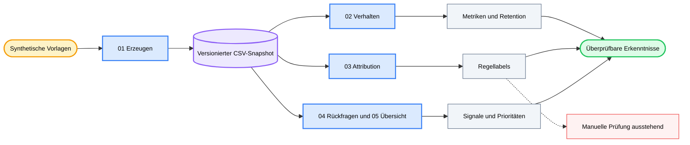

<div align="center">

# 💬 AI Chat Analytics

### *Verwandle synthetische Gesprächsereignisse in überprüfbare Erkenntnisse zur Produktqualität.*

[](LICENSE) [](notebooks/01_data_generation.ipynb) [](notebooks) [](#data-and-privacy) [](https://github.com/okht/ai-chat-analytics)

[](data/users.csv) [](data/conversations.csv) [](data/events.csv) [](#data-and-privacy)

<br>

<table>
<tr><td align="left">

📭 &nbsp;5.394 stille Gespräche verschwinden, wenn die Analyse nur bei den Ereignissen beginnt.<br>
🔀 &nbsp;Wiederholungen und Rückfragen haben in sechs Intent-Szenarien unterschiedliche Bedeutungen.<br>
🔎 &nbsp;71,2 % der regelbasiert markierten Problemfälle landen in einer einzigen Auffangkategorie für Qualität.

</td></tr>
</table>

### ✨ Verknüpfe Verhaltensmetriken, regelbasierte Attribution, Rückfragesignale und Priorisierung mit einem einzigen versionierten synthetischen Snapshot.

**Synthetische Vorlagen → versionierter CSV-Snapshot → Verhaltens-, Attributions- und Rückfrageanalysen → Produktprioritäten**

<br>

[📊 Snapshot](#snapshot) · [🧭 Analysepfade](#analysis-tracks) · [📈 Ergebnisse](#results) · [🗺️ Workflow](#workflow) · [🚀 Reproduzieren](#reproduce) · [🔬 Methodik](#methodology) · [🔐 Daten & Datenschutz](#data-and-privacy) · [🧪 Verifikation](#verification) · [📁 Struktur](#project-structure) · [📌 Grenzen](#limitations) · [📝 Hinweise](#notes)

[**English**](README.md) · [**简体中文**](README_CN.md) · [**Español**](README_ES.md) · [**Deutsch**](README_DE.md) · [**日本語**](README_JA.md) · [**Русский**](README_RU.md) · [**Português**](README_PT.md) · [**한국어**](README_KO.md)

</div>

---

<a id="snapshot"></a>
## 📊 Snapshot

AI Chat Analytics ist ein Forschungsbeispiel mit fünf Notebooks zur Untersuchung von Produktsignalen in dialogorientierter KI. Der versionierte Snapshot wird aus festen Vorlagen erzeugt; die Zufallskeime von NumPy und Python stehen auf `42`.

| Datensatz | Zeilen | Umfang |
|---|---:|---|
| **Nutzer** | 500 | Anonyme synthetische IDs in intensiven, gelegentlichen und abgewanderten Kohorten |
| **Gespräche** | 22.394 | Sechs vorab zugewiesene Intent-Szenarien vom 01.03.2025 bis 31.03.2025 |
| **Ereignisse** | 19.952 | Like-, Dislike-, Retry- und Follow-up-Ereignisse |
| **Problemfälle** | 7.363 | Gespräche, deren erstes Ereignis Dislike oder Retry ist |

Der Snapshot enthält 5.394 Gespräche ohne Ereignis. Diese stillen Gespräche entsprechen 24,1 % aller Gespräche und bleiben im Nenner enthalten.

---

<a id="analysis-tracks"></a>
## 🧭 Analysepfade

| Notebook | Frage | Methode | Aktuelles Artefakt |
|---|---|---|---|
| **01 · Datenerzeugung** | Was lässt sich ohne private Produktdaten untersuchen? | Vorlagen mit festem Zufallskeim, Kohorten und szenariospezifischen Ereigniswahrscheinlichkeiten | Drei versionierte CSV-Dateien |
| **02 · Verhaltensanalyse** | Was zeigt das erste beobachtete Verhalten? | Verteilung, Szenario-Kreuztabellen, Aktivität, Retention und Tagestrends | Notebook-Code; keine gespeicherte Ausführungsausgabe |
| **03 · Semantische Attribution** | Warum treten Dislikes und Retries auf? | Fünf regelbasierte Labels und eine ausstehende Spalte für manuelle Prüfung | `output/bad_cases_for_labeling.csv` |
| **04 · Rückfragesignale** | Welche Rückfragen wirken korrigierend? | Schlüsselwortaufteilung und Szenariovergleich | Notebook-Code; keine gespeicherte Ausführungsausgabe |
| **05 · Erkenntnisübersicht** | Welche Szenarien wirken in diesem Snapshot besonders dringend? | Neu berechnete Metriken und Prioritätskarten | Notebook-Code; keine gespeicherte Ausführungsausgabe |

Der optionale LLM-Attributionspfad in Notebook 03 ist eine nicht ausgeführte Vorlage. Das Repository enthält keine von einem LLM erzeugten Labels.

---

<a id="results"></a>
## 📈 Ergebnisse aus dem versionierten Snapshot

Die folgenden Werte wurden direkt aus den versionierten CSV-Dateien neu berechnet.

### Verteilung des ersten Ereignisses

| Erstes Verhalten | Gespräche | Anteil |
|---|---:|---:|
| **Like** | 5.302 | 23,7 % |
| **Dislike** | 3.165 | 14,1 % |
| **Retry** | 4.198 | 18,7 % |
| **Rückfrage** | 4.335 | 19,4 % |
| **Still** | 5.394 | 24,1 % |

### Szenarioansicht

`Unzufriedenheit = Dislike-Anteil + Retry-Anteil`, jeweils anhand des ersten Ereignisses eines Gesprächs.

| Szenario | Gespräche | Unzufriedenheit |
|---|---:|---:|
| **Codegenerierung** | 5.615 | 45,1 % |
| **Datenanalyse** | 2.264 | 39,4 % |
| **Wissensfragen** | 5.602 | 39,3 % |
| **Kreatives Schreiben** | 3.325 | 25,7 % |
| **Übersetzung** | 3.354 | 19,8 % |
| **Smalltalk** | 2.234 | 9,8 % |

### Regelattribution und Rückfragen

| Erkenntnis | Wert | Interpretationsgrenze |
|---|---:|---|
| **Qualitäts-Auffanglabel** | 71,2 % | Die Regelabdeckung ist begrenzt; dies ist keine validierte Ursachenquote |
| **Formatabweichung** | 12,4 % | Regelbasierter Anteil an 7.363 Problemfällen |
| **Ablehnung** | 6,8 % | Regelbasierter Anteil an 7.363 Problemfällen |
| **Halluzination** | 6,7 % | Regelbasierter Anteil an 7.363 Problemfällen |
| **Korrigierende Rückfragen** | 40,2 % | Schlüsselwortklassifizierter Anteil an 4.335 Rückfragen |
| **Korrigierender Anteil bei Wissensfragen** | 63,5 % | Szenariospezifisches Schlüsselwortergebnis |

Alle 7.363 Zeilen besitzen ein Regellabel. Die Spalte `attribution_manual` ist in jeder Zeile leer.

---

<a id="workflow"></a>
## 🗺️ Workflow



Notebook 05 liest die versionierten CSV-Dateien direkt und berechnet seine Übersicht neu. Gespeicherte Ausgaben der Notebooks 02–04 werden nicht verwendet.

---

<a id="reproduce"></a>
## 🚀 Reproduzieren

Klone das Repository und installiere die Abhängigkeiten ausdrücklich. Die versionierte Datei `requirements.txt` ist derzeit leer.

```powershell
git clone https://github.com/okht/ai-chat-analytics.git
cd ai-chat-analytics

python -m venv .venv
# Activate the environment for your shell, then run:
python -m pip install pandas numpy plotly jupyter
```

Öffne Jupyter aus dem Verzeichnis `notebooks`, da die Notebooks relative Pfade wie `../data` und `../output` verwenden.

```powershell
cd notebooks
jupyter notebook
```

Führe die Notebooks in dieser Reihenfolge aus:

1. `01_data_generation.ipynb`
2. `02_behavior_analysis.ipynb`
3. `03_semantic_attribution_analysis.ipynb`
4. `04_follow_up_signal_analysis.ipynb`
5. `05_insights_summary.ipynb`

> 📌 Nutze für Ergebnisvergleiche einen frischen Klon. Notebook 01 überschreibt die versionierten Dateien in `data/`, und Notebook 03 überschreibt `output/bad_cases_for_labeling.csv`.

Der Kernpfad benötigt keinen OpenAI-Schlüssel. Notebook 03 enthält zusätzlich eine optionale, auskommentierte LLM-Labelvorlage; für ihre Aktivierung müssen SDK und Zugangsdaten separat eingerichtet werden.

---

<a id="methodology"></a>
## 🔬 Methodik

| Stufe | Aktuelle Regel | Folge |
|---|---|---|
| **Intent** | Bei der synthetischen Erzeugung wird eines von sechs Intent-Labels zugewiesen | Die Genauigkeit einer Intent-Klassifikation gehört nicht zur Evidenz dieses Repositorys |
| **Primärverhalten** | Das früheste Ereignis wird zum Primärverhalten des Gesprächs | Spätere Ereignisse bleiben erhalten, definieren aber nicht die Hauptquoten |
| **Stille** | Ein Gespräch ohne Ereignis wird als still gezählt | Eine reine Ereignisanalyse würde 5.394 Gespräche auslassen |
| **Problemfall** | Das erste Ereignis ist Dislike oder Retry | Die versionierte Problemfallmenge enthält 7.363 Gespräche |
| **Unzufriedenheit** | Dislike-Anteil plus Retry-Anteil | Dies ist eine projektspezifische Diagnosemetrik |
| **Attribution** | Geordnete Schlüsselwortregeln vergeben eines von fünf Labels | 71,2 % erreichen das Qualitäts-Auffanglabel |
| **Rückfragetyp** | Korrigierende Schlüsselwörter trennen Rückfragen vom explorativen Standard | Die Aufteilung spiegelt Vorlagen und Regeln dieses Snapshots wider |

Die Regellabels dienen als Vorannotation für eine Prüfung. Sie wurden weder gegen menschliche Labels noch gegen einen LLM-generierten Referenzsatz validiert.

---

<a id="data-and-privacy"></a>
## 🔐 Daten und Datenschutz

| Datei | Felder | Rolle der öffentlichen Daten |
|---|---|---|
| **`data/users.csv`** | Synthetische ID, Kohorte, Registrierungsdatum | Anonymer Nutzerdatensatz |
| **`data/conversations.csv`** | Gespräch, Nutzer, Sitzung, Zeit, Intent, Anfrage, Antwort | Vorlagengenerierter Gesprächsdatensatz |
| **`data/events.csv`** | Ereignis, Gespräch, Typ, Zeit, Rückfragetext | Vorlagengenerierter Ereignisstrom |
| **`output/bad_cases_for_labeling.csv`** | Problemfall, Regellabel, leeres manuelles Label | Von Notebook 03 erzeugtes Prüfblatt |

- Es sind keine echten Nutzerdaten, Konto-IDs, E-Mail-Adressen oder privaten Produktlogs enthalten.
- Die synthetischen IDs sind mit keinem ChatGPT-, Claude- oder anderen Dienstkonto verbunden.
- Der Kernpfad liest lokale CSV-Dateien und sendet keine Netzwerkanfrage.
- `sk-xxx` in Notebook 03 ist ein Platzhalter in einer nicht ausgeführten optionalen Vorlage.
- Vor der Anpassung an echte Produktdaten sind Datenschutz, Einwilligung, Aufbewahrung und Zugriff separat zu prüfen.

---

<a id="verification"></a>
## 🧪 Verifikation

| Prüfung | Aktuelle Evidenz |
|---|---|
| **Notebook-Syntax** | Alle 29 Codezellen lassen sich als Python parsen |
| **Gespeicherter Ausführungsstand** | Notebook 01 besitzt gespeicherte Ausgaben; Notebooks 02–05 nicht |
| **Primärschlüssel** | Nutzer-, Gesprächs- und Ereignis-IDs sind eindeutig |
| **Referenzen** | Jeder Gesprächsnutzer und jedes Ereignisgespräch lässt sich auflösen |
| **Ereigniszeit** | Kein Ereignis liegt vor dem Zeitstempel seines Gesprächs |
| **Manuelle Labels** | 0 von 7.363 Zeilen abgeschlossen |
| **Automatisierte Tests** | Es ist keine automatisierte Testsuite enthalten |

Die Ergebnistabellen dieses README wurden gegen den versionierten CSV-Snapshot geprüft. Sie stellen keinen Produktionsbenchmark dar.

---

<a id="project-structure"></a>
## 📁 Projektstruktur

```text
ai-chat-analytics/
├── README.md
├── README_CN.md
├── README_ES.md
├── README_DE.md
├── README_JA.md
├── README_RU.md
├── README_PT.md
├── README_KO.md
├── LICENSE
├── requirements.txt                  # currently empty
├── data/
│   ├── users.csv
│   ├── conversations.csv
│   └── events.csv
├── notebooks/
│   ├── 01_data_generation.ipynb
│   ├── 02_behavior_analysis.ipynb
│   ├── 03_semantic_attribution_analysis.ipynb
│   ├── 04_follow_up_signal_analysis.ipynb
│   └── 05_insights_summary.ipynb
├── output/
│   └── bad_cases_for_labeling.csv
└── src/
    └── utils.py                      # currently empty
```

---

<a id="limitations"></a>
## 📌 Grenzen

- Alle versionierten Zeilen sind synthetisch; echtes Nutzerverhalten kann erheblich abweichen.
- Intent-Labels werden bei der Datenerzeugung vergeben und bewerten keinen Klassifikator.
- Abhängigkeitsversionen sind nicht fixiert, und `requirements.txt` ist leer.
- `src/utils.py` ist leer; der aktive Analysecode befindet sich in den Notebooks.
- Die Notebooks 02–05 besitzen im versionierten Snapshot keine gespeicherten Ausführungsausgaben.
- Die Spalte für manuelle Labels ist leer, daher ist die Genauigkeit der Regelattribution unbekannt.
- Der optionale LLM-Pfad ist eine nicht ausgeführte Vorlage ohne versioniertes Ergebnis.
- Automatisierte Tests, CI-Workflow, Release und Kompatibilitätsmatrix fehlen.

---

<a id="notes"></a>
## 📝 Hinweise

Nutze die versionierten Erkenntnisse als überprüfbares Beispiel für Metrikkonstruktion und Analysegrenzen. Prüfe jede Annahme erneut, bevor du den Workflow auf einen anderen Datensatz überträgst.

Issues und Pull Requests sind willkommen.

---

<div align="center">

**Halte jede Produktempfehlung auf ihre Daten und Annahmen zurückführbar.**

<br>

MIT-Lizenz · Gepflegt von [okht](https://github.com/okht)

</div>
