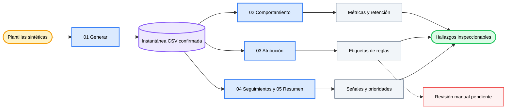

<div align="center">

# 💬 AI Chat Analytics

### *Convierte eventos sintéticos de conversación en hallazgos inspeccionables sobre la calidad del producto.*

[](LICENSE) [](notebooks/01_data_generation.ipynb) [](notebooks) [](#data-and-privacy) [](https://github.com/okht/ai-chat-analytics)

[](data/users.csv) [](data/conversations.csv) [](data/events.csv) [](#data-and-privacy)

<br>

<table>
<tr><td align="left">

📭 &nbsp;5.394 conversaciones silenciosas desaparecen si el análisis parte solo de los eventos.<br>
🔀 &nbsp;Los reintentos y las preguntas de seguimiento tienen significados distintos en seis escenarios de intención.<br>
🔎 &nbsp;El 71,2% de los casos problemáticos etiquetados por reglas cae en una sola categoría residual de calidad.

</td></tr>
</table>

### ✨ Vincula métricas de comportamiento, atribución por reglas, señales de seguimiento y priorización con una única instantánea sintética confirmada.

**Plantillas sintéticas → instantánea CSV confirmada → análisis de comportamiento, atribución y seguimiento → prioridades de producto**

<br>

[📊 Resumen](#snapshot) · [🧭 Rutas de análisis](#analysis-tracks) · [📈 Resultados](#results) · [🗺️ Flujo](#workflow) · [🚀 Reproducir](#reproduce) · [🔬 Metodología](#methodology) · [🔐 Datos y privacidad](#data-and-privacy) · [🧪 Verificación](#verification) · [📁 Estructura](#project-structure) · [📌 Limitaciones](#limitations) · [📝 Notas](#notes)

[**English**](README.md) · [**简体中文**](README_CN.md) · [**Español**](README_ES.md) · [**Deutsch**](README_DE.md) · [**日本語**](README_JA.md) · [**Русский**](README_RU.md) · [**Português**](README_PT.md) · [**한국어**](README_KO.md)

</div>

---

<a id="snapshot"></a>
## 📊 Resumen

AI Chat Analytics es un ejemplo de investigación con cinco notebooks para estudiar señales de producto en IA conversacional. La instantánea confirmada se genera con plantillas fijas y semillas `42` para NumPy y el generador aleatorio de Python.

| Conjunto de datos | Filas | Alcance |
|---|---:|---|
| **Usuarios** | 500 | Identificadores sintéticos anónimos en cohortes intensivas, ocasionales y abandonadas |
| **Conversaciones** | 22.394 | Seis escenarios de intención preasignados entre 2025-03-01 y 2025-03-31 |
| **Eventos** | 19.952 | Me gusta, no me gusta, reintentos y seguimientos |
| **Casos problemáticos** | 7.363 | Conversaciones cuyo primer evento es no me gusta o reintento |

La instantánea contiene 5.394 conversaciones sin eventos. Representan el 24,1% del total y se mantienen en el denominador.

---

<a id="analysis-tracks"></a>
## 🧭 Rutas de análisis

| Notebook | Pregunta | Método | Artefacto actual |
|---|---|---|---|
| **01 · Generación de datos** | ¿Qué puede estudiarse sin datos privados de producto? | Plantillas con semilla, cohortes y probabilidades de eventos por escenario | Tres archivos CSV confirmados |
| **02 · Análisis de comportamiento** | ¿Qué revela el primer comportamiento observado? | Distribución, tablas cruzadas, actividad, retención y tendencias diarias | Código del notebook; sin salida de ejecución guardada |
| **03 · Atribución semántica** | ¿Por qué aparecen los no me gusta y los reintentos? | Reglas de palabras clave con cinco etiquetas y una columna pendiente de revisión manual | `output/bad_cases_for_labeling.csv` |
| **04 · Señales de seguimiento** | ¿Qué seguimientos parecen correctivos? | División por palabras clave y comparación por escenario | Código del notebook; sin salida de ejecución guardada |
| **05 · Resumen de hallazgos** | ¿Qué escenarios parecen más urgentes en esta instantánea? | Métricas recalculadas y tarjetas de prioridad | Código del notebook; sin salida de ejecución guardada |

La ruta opcional de atribución con LLM del notebook 03 es una plantilla sin ejecutar. El repositorio confirmado no contiene etiquetas generadas por un LLM.

---

<a id="results"></a>
## 📈 Resultados de la instantánea confirmada

Los siguientes valores se recalcularon directamente desde los archivos CSV confirmados.

### Distribución del primer evento

| Primer comportamiento | Conversaciones | Proporción |
|---|---:|---:|
| **Me gusta** | 5.302 | 23,7% |
| **No me gusta** | 3.165 | 14,1% |
| **Reintento** | 4.198 | 18,7% |
| **Seguimiento** | 4.335 | 19,4% |
| **Silencio** | 5.394 | 24,1% |

### Vista por escenario

`Insatisfacción = proporción de no me gusta + proporción de reintentos`, usando el primer evento de cada conversación.

| Escenario | Conversaciones | Insatisfacción |
|---|---:|---:|
| **Generación de código** | 5.615 | 45,1% |
| **Análisis de datos** | 2.264 | 39,4% |
| **Preguntas de conocimiento** | 5.602 | 39,3% |
| **Escritura creativa** | 3.325 | 25,7% |
| **Traducción** | 3.354 | 19,8% |
| **Conversación informal** | 2.234 | 9,8% |

### Atribución por reglas y seguimientos

| Hallazgo | Valor | Límite de interpretación |
|---|---:|---|
| **Etiqueta residual de calidad** | 71,2% | La cobertura de reglas es limitada; no es una tasa de causa raíz validada |
| **Formato no coincidente** | 12,4% | Proporción asignada por reglas en 7.363 casos problemáticos |
| **Rechazo** | 6,8% | Proporción asignada por reglas en 7.363 casos problemáticos |
| **Alucinación** | 6,7% | Proporción asignada por reglas en 7.363 casos problemáticos |
| **Seguimientos correctivos** | 40,2% | Proporción clasificada por palabras clave entre 4.335 seguimientos |
| **Seguimientos correctivos en conocimiento** | 63,5% | Resultado de palabras clave para ese escenario |

Las 7.363 filas tienen una etiqueta de regla. La columna `attribution_manual` sigue vacía en todas ellas.

---

<a id="workflow"></a>
## 🗺️ Flujo de trabajo



El notebook 05 lee directamente los CSV confirmados y recalcula su resumen. No consume salidas guardadas de los notebooks 02–04.

---

<a id="reproduce"></a>
## 🚀 Reproducir

Clona el repositorio e instala las dependencias de forma explícita. El archivo `requirements.txt` incluido en el repositorio está vacío.

```powershell
git clone https://github.com/okht/ai-chat-analytics.git
cd ai-chat-analytics

python -m venv .venv
# Activate the environment for your shell, then run:
python -m pip install pandas numpy plotly jupyter
```

Abre Jupyter desde el directorio `notebooks`, ya que los notebooks usan rutas relativas como `../data` y `../output`.

```powershell
cd notebooks
jupyter notebook
```

Ejecuta los notebooks en este orden:

1. `01_data_generation.ipynb`
2. `02_behavior_analysis.ipynb`
3. `03_semantic_attribution_analysis.ipynb`
4. `04_follow_up_signal_analysis.ipynb`
5. `05_insights_summary.ipynb`

> 📌 Ejecuta la secuencia completa en un clon nuevo al comparar resultados. El notebook 01 reescribe los archivos confirmados de `data/` y el notebook 03 reescribe `output/bad_cases_for_labeling.csv`.

La ruta principal no requiere una clave de OpenAI. El notebook 03 incluye además una plantilla opcional y comentada de etiquetado con LLM; para activarla hay que configurar por separado el SDK y la credencial.

---

<a id="methodology"></a>
## 🔬 Metodología

| Etapa | Regla actual | Consecuencia |
|---|---|---|
| **Intención** | Se asigna una de seis etiquetas durante la generación sintética | La precisión de un clasificador de intención queda fuera de la evidencia del repositorio |
| **Comportamiento principal** | El evento más temprano define el comportamiento principal | Los eventos posteriores se conservan, pero no definen las tasas principales |
| **Silencio** | Una conversación sin eventos se cuenta como silenciosa | Un análisis solo de eventos omitiría 5.394 conversaciones |
| **Caso problemático** | El primer evento es no me gusta o reintento | El conjunto confirmado contiene 7.363 conversaciones |
| **Insatisfacción** | Proporción de no me gusta más proporción de reintentos | Es una métrica diagnóstica definida por el proyecto |
| **Atribución** | Reglas ordenadas asignan una de cinco etiquetas | El 71,2% llega a la categoría residual de calidad |
| **Tipo de seguimiento** | Palabras correctivas separan el seguimiento del valor exploratorio predeterminado | La división refleja las plantillas y reglas de esta instantánea |

Las etiquetas de reglas son preanotaciones para revisión. No se han validado con etiquetas humanas ni con un conjunto de referencia generado por LLM.

---

<a id="data-and-privacy"></a>
## 🔐 Datos y privacidad

| Archivo | Campos | Papel en los datos públicos |
|---|---|---|
| **`data/users.csv`** | ID sintético, cohorte y fecha de alta | Muestra anónima de usuarios |
| **`data/conversations.csv`** | Conversación, usuario, sesión, fecha, intención, consulta y respuesta | Muestra de conversaciones generada por plantillas |
| **`data/events.csv`** | Evento, conversación, tipo, fecha y texto de seguimiento | Flujo de eventos generado por plantillas |
| **`output/bad_cases_for_labeling.csv`** | Caso problemático, etiqueta de regla y etiqueta manual vacía | Hoja de revisión creada por el notebook 03 |

- No se incluyen datos de usuarios reales, identificadores de cuenta, correos ni registros privados de producto.
- Los ID sintéticos no se conectan con cuentas de ChatGPT, Claude u otros servicios.
- La ruta principal lee CSV locales y no realiza solicitudes de red.
- El texto `sk-xxx` del notebook 03 es un marcador dentro de una plantilla opcional sin ejecutar.
- Adaptar el flujo a datos reales exige una revisión independiente de privacidad, consentimiento, retención y acceso.

---

<a id="verification"></a>
## 🧪 Verificación

| Comprobación | Evidencia actual |
|---|---|
| **Sintaxis de notebooks** | Las 29 celdas de código se analizan como Python |
| **Estado de ejecución guardado** | El notebook 01 tiene salidas guardadas; los notebooks 02–05 no |
| **Claves primarias** | Los ID de usuario, conversación y evento son únicos |
| **Referencias** | Cada usuario de conversación y conversación de evento se resuelve |
| **Tiempo de eventos** | Ningún evento precede a su conversación |
| **Etiquetas manuales** | 0 de 7.363 filas completadas |
| **Pruebas automatizadas** | No se incluye una suite de pruebas automatizadas |

Las tablas de resultados de este README se contrastaron con la instantánea CSV confirmada. No representan un benchmark de producción.

---

<a id="project-structure"></a>
## 📁 Estructura del proyecto

```text
ai-chat-analytics/
├── README.md
├── README_CN.md
├── README_ES.md
├── README_DE.md
├── README_JA.md
├── README_RU.md
├── README_PT.md
├── README_KO.md
├── LICENSE
├── requirements.txt                  # currently empty
├── data/
│   ├── users.csv
│   ├── conversations.csv
│   └── events.csv
├── notebooks/
│   ├── 01_data_generation.ipynb
│   ├── 02_behavior_analysis.ipynb
│   ├── 03_semantic_attribution_analysis.ipynb
│   ├── 04_follow_up_signal_analysis.ipynb
│   └── 05_insights_summary.ipynb
├── output/
│   └── bad_cases_for_labeling.csv
└── src/
    └── utils.py                      # currently empty
```

---

<a id="limitations"></a>
## 📌 Limitaciones

- Todas las filas confirmadas son sintéticas; el comportamiento real puede diferir de forma sustancial.
- Las intenciones se asignan durante la generación y no evalúan un clasificador.
- Las dependencias no tienen versiones fijadas y `requirements.txt` está vacío.
- `src/utils.py` está vacío; el análisis activo vive en los notebooks.
- Los notebooks 02–05 no tienen salidas de ejecución guardadas en la instantánea confirmada.
- La columna de etiquetas manuales está vacía, por lo que se desconoce la precisión de la atribución por reglas.
- La ruta LLM opcional es una plantilla sin ejecutar y no tiene resultados confirmados.
- No se incluyen pruebas automatizadas, flujo de CI, versión publicada ni matriz de compatibilidad.

---

<a id="notes"></a>
## 📝 Notas

Usa los hallazgos confirmados como un ejemplo inspeccionable de construcción de métricas y límites analíticos. Revalida cada supuesto antes de adaptar el flujo a otro conjunto de datos.

Los issues y pull requests son bienvenidos.

---

<div align="center">

**Mantén cada recomendación de producto vinculada a sus datos y supuestos.**

<br>

Licencia MIT · Mantenido por [okht](https://github.com/okht)

</div>
