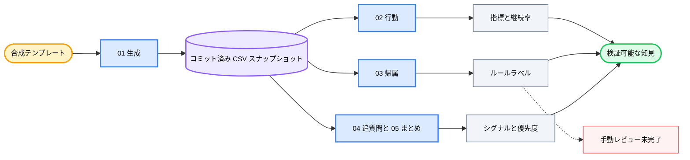

<div align="center">

# 💬 AI Chat Analytics

### *合成会話イベントを、検証可能な製品品質の知見へ。*

[](LICENSE) [](notebooks/01_data_generation.ipynb) [](notebooks) [](#data-and-privacy) [](https://github.com/okht/ai-chat-analytics)

[](data/users.csv) [](data/conversations.csv) [](data/events.csv) [](#data-and-privacy)

<br>

<table>
<tr><td align="left">

📭 &nbsp;イベントだけを起点にすると、5,394 件の無反応会話が分析から消えます。<br>
🔀 &nbsp;再試行と追質問は、6 種類の意図シナリオごとに異なる意味を持ちます。<br>
🔎 &nbsp;ルールで分類した問題ケースの 71.2% が、1 つの品質その他カテゴリに入ります。

</td></tr>
</table>

### ✨ 行動指標、ルールベース帰属、追質問シグナル、優先順位を、1 つのコミット済み合成スナップショットに結び付けます。

**合成テンプレート → コミット済み CSV スナップショット → 行動・帰属・追質問分析 → 製品優先順位**

<br>

[📊 スナップショット](#snapshot) · [🧭 分析トラック](#analysis-tracks) · [📈 結果](#results) · [🗺️ ワークフロー](#workflow) · [🚀 再現](#reproduce) · [🔬 方法](#methodology) · [🔐 データとプライバシー](#data-and-privacy) · [🧪 検証](#verification) · [📁 構成](#project-structure) · [📌 制約](#limitations) · [📝 注記](#notes)

[**English**](README.md) · [**简体中文**](README_CN.md) · [**Español**](README_ES.md) · [**Deutsch**](README_DE.md) · [**日本語**](README_JA.md) · [**Русский**](README_RU.md) · [**Português**](README_PT.md) · [**한국어**](README_KO.md)

</div>

---

<a id="snapshot"></a>
## 📊 スナップショット

AI Chat Analytics は、会話型 AI 製品のシグナルを調べるための 5 つの Notebook から成る研究例です。コミット済みスナップショットは固定テンプレートから生成され、NumPy と Python の乱数シードは `42` に設定されています。

| データセット | 行数 | 範囲 |
|---|---:|---|
| **ユーザー** | 500 | ヘビー、カジュアル、離脱コホートの匿名合成 ID |
| **会話** | 22,394 | 2025-03-01 から 2025-03-31 までの事前割り当て済み 6 意図シナリオ |
| **イベント** | 19,952 | いいね、低評価、再試行、追質問イベント |
| **問題ケース** | 7,363 | 最初のイベントが低評価または再試行の会話 |

スナップショットにはイベントのない会話が 5,394 件あります。全会話の 24.1% に当たり、分母には引き続き含まれます。

---

<a id="analysis-tracks"></a>
## 🧭 分析トラック

| Notebook | 問い | 方法 | 現在の成果物 |
|---|---|---|---|
| **01 · データ生成** | 非公開の製品データなしで何を調べられるか？ | シード固定テンプレート、ユーザーコホート、シナリオ別イベント確率 | コミット済み CSV 3 ファイル |
| **02 · 行動分析** | 最初に観測された行動から何が分かるか？ | イベント分布、シナリオクロス集計、活動、継続率、日次傾向 | Notebook コード；保存済み実行出力なし |
| **03 · 意味帰属** | 低評価と再試行はなぜ起きるか？ | 5 ラベルのキーワードルールと未完了の手動レビュー列 | `output/bad_cases_for_labeling.csv` |
| **04 · 追質問シグナル** | どの追質問が訂正的に見えるか？ | キーワード分割とシナリオ比較 | Notebook コード；保存済み実行出力なし |
| **05 · 知見まとめ** | このスナップショットで優先度が高く見えるシナリオは何か？ | 指標の再計算と優先度カード | Notebook コード；保存済み実行出力なし |

Notebook 03 の任意 LLM 帰属ルートは未実行のテンプレートです。コミット済みリポジトリには LLM 生成ラベルがありません。

---

<a id="results"></a>
## 📈 コミット済みスナップショットの結果

以下の値は、コミット済み CSV ファイルから直接再計算しました。

### 最初のイベント分布

| 最初の行動 | 会話数 | 割合 |
|---|---:|---:|
| **いいね** | 5,302 | 23.7% |
| **低評価** | 3,165 | 14.1% |
| **再試行** | 4,198 | 18.7% |
| **追質問** | 4,335 | 19.4% |
| **無反応** | 5,394 | 24.1% |

### シナリオ別

`不満率 = 低評価の割合 + 再試行の割合` とし、各会話の最初のイベントを使います。

| シナリオ | 会話数 | 不満率 |
|---|---:|---:|
| **コード生成** | 5,615 | 45.1% |
| **データ分析** | 2,264 | 39.4% |
| **知識 Q&A** | 5,602 | 39.3% |
| **創作** | 3,325 | 25.7% |
| **翻訳** | 3,354 | 19.8% |
| **雑談** | 2,234 | 9.8% |

### ルール帰属と追質問

| 知見 | 値 | 解釈上の境界 |
|---|---:|---|
| **品質その他ラベル** | 71.2% | ルールの網羅性は限定的で、検証済み根因率ではありません |
| **形式不一致** | 12.4% | 7,363 件の問題ケースに対するルール割り当て比率 |
| **回答拒否** | 6.8% | 7,363 件の問題ケースに対するルール割り当て比率 |
| **ハルシネーション** | 6.7% | 7,363 件の問題ケースに対するルール割り当て比率 |
| **訂正的追質問** | 40.2% | 4,335 件の追質問に対するキーワード分類比率 |
| **知識 Q&A の訂正比率** | 63.5% | シナリオ固有のキーワード結果 |

7,363 行すべてにルールラベルがあります。`attribution_manual` 列は全行で空です。

---

<a id="workflow"></a>
## 🗺️ ワークフロー



Notebook 05 はコミット済み CSV を直接読み、まとめを再計算します。Notebook 02–04 の保存済み出力は使用しません。

---

<a id="reproduce"></a>
## 🚀 再現

リポジトリをクローンし、依存関係を明示的にインストールします。追跡中の `requirements.txt` は現在空です。

```powershell
git clone https://github.com/okht/ai-chat-analytics.git
cd ai-chat-analytics

python -m venv .venv
# Activate the environment for your shell, then run:
python -m pip install pandas numpy plotly jupyter
```

Notebook は `../data` や `../output` の相対パスを使うため、`notebooks` ディレクトリから Jupyter を開きます。

```powershell
cd notebooks
jupyter notebook
```

次の順番で実行します。

1. `01_data_generation.ipynb`
2. `02_behavior_analysis.ipynb`
3. `03_semantic_attribution_analysis.ipynb`
4. `04_follow_up_signal_analysis.ipynb`
5. `05_insights_summary.ipynb`

> 📌 結果を比較するときは、新しいクローンで全手順を実行してください。Notebook 01 は `data/` のコミット済みファイルを、Notebook 03 は `output/bad_cases_for_labeling.csv` を上書きします。

コア経路に OpenAI キーは不要です。Notebook 03 には、コメント化された任意の LLM ラベル付けテンプレートもあります。有効化には SDK と認証情報を別途設定する必要があります。

---

<a id="methodology"></a>
## 🔬 方法

| 段階 | 現在のルール | 影響 |
|---|---|---|
| **意図** | 合成生成時に 6 ラベルの 1 つを割り当てる | 意図分類器の精度は、このリポジトリの証拠範囲外です |
| **主要行動** | 最も早いイベントを会話の主要行動とする | 後続イベントは保持されますが、主要比率を定義しません |
| **無反応** | イベントのない会話を無反応として数える | イベントだけの分析では 5,394 会話を除外します |
| **問題ケース** | 最初のイベントが低評価または再試行 | コミット済み問題ケースは 7,363 会話です |
| **不満率** | 低評価の割合と再試行の割合の合計 | プロジェクト独自の診断指標です |
| **帰属** | 順序付きキーワードルールで 5 ラベルの 1 つを割り当てる | 71.2% が品質その他ラベルに入ります |
| **追質問タイプ** | 訂正キーワードを探索的デフォルトから分離する | 分類はこのスナップショットのテンプレートとルールを反映します |

ルールラベルはレビュー用の事前注釈です。人手ラベルや LLM 生成の正解セットによる検証は完了していません。

---

<a id="data-and-privacy"></a>
## 🔐 データとプライバシー

| ファイル | フィールド | 公開データでの役割 |
|---|---|---|
| **`data/users.csv`** | 合成 ID、コホート、登録日 | 匿名ユーザーフィクスチャ |
| **`data/conversations.csv`** | 会話、ユーザー、セッション、時刻、意図、質問、応答 | テンプレート生成の会話フィクスチャ |
| **`data/events.csv`** | イベント、会話、種類、時刻、追質問文 | テンプレート生成のイベントストリーム |
| **`output/bad_cases_for_labeling.csv`** | 問題ケース、ルールラベル、空の手動ラベル | Notebook 03 が生成するレビュー用ワークシート |

- 実ユーザーデータ、アカウント識別子、メール、非公開製品ログは含まれません。
- 合成 ID は ChatGPT、Claude、その他のサービスアカウントに接続しません。
- コア Notebook 経路はローカル CSV を読み、ネットワークリクエストを行いません。
- Notebook 03 の `sk-xxx` は未実行の任意テンプレート内にあるプレースホルダーです。
- 実製品データへ適用する前に、プライバシー、同意、保持期間、アクセス制御を個別に確認する必要があります。

---

<a id="verification"></a>
## 🧪 検証

| 検査 | 現在の証拠 |
|---|---|
| **Notebook 構文** | 29 個のコードセルすべてが Python として解析可能 |
| **保存済み実行状態** | Notebook 01 には保存済み出力があり、Notebook 02–05 にはありません |
| **主キー** | ユーザー、会話、イベント ID は一意 |
| **参照** | すべての会話ユーザーとイベント会話を解決可能 |
| **イベント時刻** | 対応する会話より前のイベントはありません |
| **手動ラベル** | 7,363 行中 0 行完了 |
| **自動テスト** | 自動テストスイートは含まれません |

この README の結果表は、コミット済み CSV スナップショットと照合済みです。製品環境のベンチマークではありません。

---

<a id="project-structure"></a>
## 📁 プロジェクト構成

```text
ai-chat-analytics/
├── README.md
├── README_CN.md
├── README_ES.md
├── README_DE.md
├── README_JA.md
├── README_RU.md
├── README_PT.md
├── README_KO.md
├── LICENSE
├── requirements.txt                  # currently empty
├── data/
│   ├── users.csv
│   ├── conversations.csv
│   └── events.csv
├── notebooks/
│   ├── 01_data_generation.ipynb
│   ├── 02_behavior_analysis.ipynb
│   ├── 03_semantic_attribution_analysis.ipynb
│   ├── 04_follow_up_signal_analysis.ipynb
│   └── 05_insights_summary.ipynb
├── output/
│   └── bad_cases_for_labeling.csv
└── src/
    └── utils.py                      # currently empty
```

---

<a id="limitations"></a>
## 📌 制約

- コミット済みの全行は合成データで、実際のユーザー行動は大きく異なる可能性があります。
- 意図ラベルはデータ生成時に割り当てられ、意図分類器を評価していません。
- 依存関係のバージョンは固定されておらず、`requirements.txt` は空です。
- `src/utils.py` は空で、現在の分析コードは Notebook にあります。
- コミット済みスナップショットの Notebook 02–05 には保存済み実行出力がありません。
- 手動ラベル列が空のため、ルール帰属の精度は不明です。
- 任意 LLM 経路は未実行テンプレートで、コミット済み結果はありません。
- 自動テスト、CI ワークフロー、Release、互換性マトリクスは含まれません。

---

<a id="notes"></a>
## 📝 注記

コミット済みの知見は、指標構築と分析境界を検証できる例として利用してください。別のデータセットに適用する前に、すべての前提を再検証してください。

Issue と Pull Request を歓迎します。

---

<div align="center">

**すべての製品提案を、データと前提まで追跡可能に。**

<br>

MIT ライセンス · [okht](https://github.com/okht) がメンテナンス

</div>
