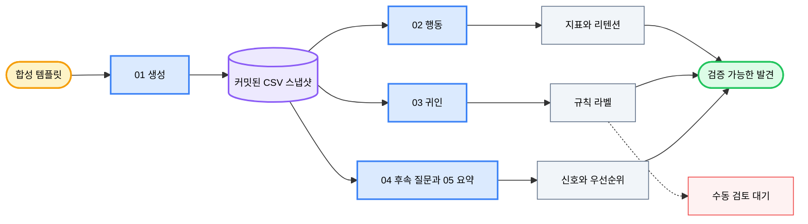

<div align="center">

# 💬 AI Chat Analytics

### *합성 대화 이벤트를 검증 가능한 제품 품질 인사이트로 전환합니다.*

[](LICENSE) [](notebooks/01_data_generation.ipynb) [](notebooks) [](#data-and-privacy) [](https://github.com/okht/ai-chat-analytics)

[](data/users.csv) [](data/conversations.csv) [](data/events.csv) [](#data-and-privacy)

<br>

<table>
<tr><td align="left">

📭 &nbsp;이벤트만으로 분석을 시작하면 무반응 대화 5,394건이 빠집니다.<br>
🔀 &nbsp;재시도와 후속 질문은 여섯 가지 의도 시나리오에서 서로 다른 의미를 가집니다.<br>
🔎 &nbsp;규칙으로 라벨링한 문제 사례의 71.2%가 하나의 품질 포괄 범주에 들어갑니다.

</td></tr>
</table>

### ✨ 행동 지표, 규칙 기반 귀인, 후속 질문 신호, 우선순위를 하나의 커밋된 합성 스냅샷에 연결합니다.

**합성 템플릿 → 커밋된 CSV 스냅샷 → 행동·귀인·후속 질문 분석 → 제품 우선순위**

<br>

[📊 스냅샷](#snapshot) · [🧭 분석 트랙](#analysis-tracks) · [📈 결과](#results) · [🗺️ 워크플로](#workflow) · [🚀 재현](#reproduce) · [🔬 방법론](#methodology) · [🔐 데이터와 개인정보](#data-and-privacy) · [🧪 검증](#verification) · [📁 구조](#project-structure) · [📌 한계](#limitations) · [📝 참고](#notes)

[**English**](README.md) · [**简体中文**](README_CN.md) · [**Español**](README_ES.md) · [**Deutsch**](README_DE.md) · [**日本語**](README_JA.md) · [**Русский**](README_RU.md) · [**Português**](README_PT.md) · [**한국어**](README_KO.md)

</div>

---

<a id="snapshot"></a>
## 📊 스냅샷

AI Chat Analytics는 대화형 AI 제품 신호를 살펴보기 위한 5개 Notebook 연구 예시입니다. 커밋된 스냅샷은 고정 템플릿으로 생성되며 NumPy와 Python 난수 시드는 `42`로 설정되어 있습니다.

| 데이터셋 | 행 수 | 범위 |
|---|---:|---|
| **사용자** | 500 | 헤비, 캐주얼, 이탈 코호트의 익명 합성 ID |
| **대화** | 22,394 | 2025-03-01부터 2025-03-31까지 미리 할당된 6개 의도 시나리오 |
| **이벤트** | 19,952 | 좋아요, 싫어요, 재시도, 후속 질문 이벤트 |
| **문제 사례** | 7,363 | 첫 이벤트가 싫어요 또는 재시도인 대화 |

스냅샷에는 이벤트가 없는 대화 5,394건이 있습니다. 전체 대화의 24.1%이며 분모에 계속 포함됩니다.

---

<a id="analysis-tracks"></a>
## 🧭 분석 트랙

| Notebook | 질문 | 방법 | 현재 산출물 |
|---|---|---|---|
| **01 · 데이터 생성** | 비공개 제품 데이터 없이 무엇을 분석할 수 있는가? | 시드 고정 템플릿, 사용자 코호트, 시나리오별 이벤트 확률 | 커밋된 CSV 파일 3개 |
| **02 · 행동 분석** | 처음 관찰된 행동은 무엇을 보여 주는가? | 이벤트 분포, 시나리오 교차표, 활동, 리텐션, 일별 추세 | Notebook 코드; 저장된 실행 출력 없음 |
| **03 · 의미 귀인** | 싫어요와 재시도는 왜 발생하는가? | 5개 키워드 규칙 라벨과 수동 검토 대기 열 | `output/bad_cases_for_labeling.csv` |
| **04 · 후속 질문 신호** | 어떤 후속 질문이 교정적으로 보이는가? | 키워드 분류와 시나리오 비교 | Notebook 코드; 저장된 실행 출력 없음 |
| **05 · 인사이트 요약** | 이 스냅샷에서 어떤 시나리오가 더 시급해 보이는가? | 지표 재계산과 우선순위 카드 | Notebook 코드; 저장된 실행 출력 없음 |

Notebook 03의 선택적 LLM 귀인 경로는 실행되지 않은 템플릿입니다. 커밋된 저장소에는 LLM 생성 라벨이 없습니다.

---

<a id="results"></a>
## 📈 커밋된 스냅샷의 결과

다음 값은 커밋된 CSV 파일에서 직접 다시 계산했습니다.

### 첫 이벤트 분포

| 첫 행동 | 대화 수 | 비율 |
|---|---:|---:|
| **좋아요** | 5,302 | 23.7% |
| **싫어요** | 3,165 | 14.1% |
| **재시도** | 4,198 | 18.7% |
| **후속 질문** | 4,335 | 19.4% |
| **무반응** | 5,394 | 24.1% |

### 시나리오별 보기

`불만족도 = 싫어요 비율 + 재시도 비율`이며 각 대화의 첫 이벤트를 사용합니다.

| 시나리오 | 대화 수 | 불만족도 |
|---|---:|---:|
| **코드 생성** | 5,615 | 45.1% |
| **데이터 분석** | 2,264 | 39.4% |
| **지식 Q&A** | 5,602 | 39.3% |
| **창의적 글쓰기** | 3,325 | 25.7% |
| **번역** | 3,354 | 19.8% |
| **잡담** | 2,234 | 9.8% |

### 규칙 귀인과 후속 질문

| 발견 | 값 | 해석 경계 |
|---|---:|---|
| **품질 포괄 라벨** | 71.2% | 규칙 범위가 제한적이며 검증된 근본 원인 비율이 아님 |
| **형식 불일치** | 12.4% | 문제 사례 7,363건 중 규칙 할당 비율 |
| **응답 거부** | 6.8% | 문제 사례 7,363건 중 규칙 할당 비율 |
| **환각** | 6.7% | 문제 사례 7,363건 중 규칙 할당 비율 |
| **교정형 후속 질문** | 40.2% | 후속 질문 4,335건 중 키워드 분류 비율 |
| **지식 Q&A 교정 비율** | 63.5% | 해당 시나리오의 키워드 결과 |

7,363개 행 모두 규칙 라벨이 있습니다. `attribution_manual` 열은 모든 행에서 비어 있습니다.

---

<a id="workflow"></a>
## 🗺️ 워크플로



Notebook 05는 커밋된 CSV를 직접 읽고 요약을 다시 계산합니다. Notebook 02–04의 저장된 출력을 사용하지 않습니다.

---

<a id="reproduce"></a>
## 🚀 재현

저장소를 클론하고 의존성을 명시적으로 설치합니다. 추적 중인 `requirements.txt`는 현재 비어 있습니다.

```powershell
git clone https://github.com/okht/ai-chat-analytics.git
cd ai-chat-analytics

python -m venv .venv
# Activate the environment for your shell, then run:
python -m pip install pandas numpy plotly jupyter
```

Notebook이 `../data`와 `../output` 같은 상대 경로를 사용하므로 `notebooks` 디렉터리에서 Jupyter를 엽니다.

```powershell
cd notebooks
jupyter notebook
```

다음 순서로 실행합니다.

1. `01_data_generation.ipynb`
2. `02_behavior_analysis.ipynb`
3. `03_semantic_attribution_analysis.ipynb`
4. `04_follow_up_signal_analysis.ipynb`
5. `05_insights_summary.ipynb`

> 📌 결과를 비교할 때는 새 클론에서 전체 순서를 실행하세요. Notebook 01은 `data/`의 커밋된 파일을 다시 쓰고, Notebook 03은 `output/bad_cases_for_labeling.csv`를 다시 씁니다.

핵심 경로에는 OpenAI 키가 필요하지 않습니다. Notebook 03에는 주석 처리된 선택적 LLM 라벨링 템플릿도 있으며, 활성화하려면 SDK와 자격 증명을 별도로 구성해야 합니다.

---

<a id="methodology"></a>
## 🔬 방법론

| 단계 | 현재 규칙 | 영향 |
|---|---|---|
| **의도** | 합성 생성 단계에서 6개 의도 라벨 중 하나를 할당 | 의도 분류기 정확도는 이 저장소의 증거 범위 밖임 |
| **주요 행동** | 가장 이른 이벤트를 대화의 주요 행동으로 사용 | 이후 이벤트는 유지되지만 주요 비율을 정의하지 않음 |
| **무반응** | 이벤트가 없는 대화를 무반응으로 계산 | 이벤트만 분석하면 5,394개 대화가 누락됨 |
| **문제 사례** | 첫 이벤트가 싫어요 또는 재시도 | 커밋된 문제 사례 집합은 7,363개 대화임 |
| **불만족도** | 싫어요 비율과 재시도 비율의 합 | 프로젝트가 정의한 진단 지표임 |
| **귀인** | 순서가 있는 키워드 규칙으로 5개 라벨 중 하나를 할당 | 71.2%가 품질 포괄 라벨에 도달함 |
| **후속 질문 유형** | 교정 키워드로 기본 탐색형과 구분 | 분류는 이 스냅샷의 템플릿과 규칙을 반영함 |

규칙 라벨은 검토 전 사전 주석입니다. 사람 라벨이나 LLM 생성 정답 집합으로 검증되지 않았습니다.

---

<a id="data-and-privacy"></a>
## 🔐 데이터와 개인정보

| 파일 | 필드 | 공개 데이터 역할 |
|---|---|---|
| **`data/users.csv`** | 합성 ID, 코호트, 가입일 | 익명 사용자 픽스처 |
| **`data/conversations.csv`** | 대화, 사용자, 세션, 시간, 의도, 질문, 응답 | 템플릿 생성 대화 픽스처 |
| **`data/events.csv`** | 이벤트, 대화, 유형, 시간, 후속 질문 텍스트 | 템플릿 생성 이벤트 스트림 |
| **`output/bad_cases_for_labeling.csv`** | 문제 사례, 규칙 라벨, 빈 수동 라벨 | Notebook 03이 생성한 검토 워크시트 |

- 실제 사용자 데이터, 계정 식별자, 이메일, 비공개 제품 로그는 포함되지 않습니다.
- 합성 ID는 ChatGPT, Claude 또는 다른 서비스 계정과 연결되지 않습니다.
- 핵심 Notebook 경로는 로컬 CSV를 읽으며 네트워크 요청을 보내지 않습니다.
- Notebook 03의 `sk-xxx`는 실행되지 않은 선택적 템플릿 안의 자리표시자입니다.
- 실제 제품 데이터에 적용하기 전에 개인정보, 동의, 보존 기간, 접근 제어를 별도로 검토해야 합니다.

---

<a id="verification"></a>
## 🧪 검증

| 검사 | 현재 증거 |
|---|---|
| **Notebook 구문** | 코드 셀 29개 모두 Python으로 파싱 가능 |
| **저장된 실행 상태** | Notebook 01에는 저장된 출력이 있고 Notebook 02–05에는 없음 |
| **기본 키** | 사용자, 대화, 이벤트 ID가 모두 고유함 |
| **참조** | 모든 대화 사용자와 이벤트 대화가 해석됨 |
| **이벤트 시간** | 해당 대화보다 앞선 이벤트가 없음 |
| **수동 라벨** | 7,363개 행 중 완료 0개 |
| **자동화 테스트** | 자동화 테스트 스위트가 포함되지 않음 |

이 README의 결과 표는 커밋된 CSV 스냅샷과 대조했습니다. 프로덕션 벤치마크를 나타내지 않습니다.

---

<a id="project-structure"></a>
## 📁 프로젝트 구조

```text
ai-chat-analytics/
├── README.md
├── README_CN.md
├── README_ES.md
├── README_DE.md
├── README_JA.md
├── README_RU.md
├── README_PT.md
├── README_KO.md
├── LICENSE
├── requirements.txt                  # currently empty
├── data/
│   ├── users.csv
│   ├── conversations.csv
│   └── events.csv
├── notebooks/
│   ├── 01_data_generation.ipynb
│   ├── 02_behavior_analysis.ipynb
│   ├── 03_semantic_attribution_analysis.ipynb
│   ├── 04_follow_up_signal_analysis.ipynb
│   └── 05_insights_summary.ipynb
├── output/
│   └── bad_cases_for_labeling.csv
└── src/
    └── utils.py                      # currently empty
```

---

<a id="limitations"></a>
## 📌 한계

- 커밋된 모든 행은 합성 데이터이며 실제 사용자 행동은 크게 다를 수 있습니다.
- 의도 라벨은 데이터 생성 중 할당되며 의도 분류기를 평가하지 않습니다.
- 의존성 버전이 고정되어 있지 않고 `requirements.txt`가 비어 있습니다.
- `src/utils.py`는 비어 있으며 현재 분석 코드는 Notebook에 있습니다.
- 커밋된 스냅샷의 Notebook 02–05에는 저장된 실행 출력이 없습니다.
- 수동 라벨 열이 비어 있어 규칙 귀인 정확도는 알 수 없습니다.
- 선택적 LLM 경로는 실행되지 않은 템플릿이며 커밋된 결과가 없습니다.
- 자동화 테스트, CI 워크플로, Release, 호환성 매트릭스가 포함되지 않습니다.

---

<a id="notes"></a>
## 📝 참고

커밋된 발견은 지표 구성과 분석 경계를 검토할 수 있는 예시로 사용하세요. 다른 데이터셋에 적용하기 전에 모든 가정을 다시 검증하세요.

Issue와 Pull Request를 환영합니다.

---

<div align="center">

**모든 제품 권고를 데이터와 가정까지 추적할 수 있게 유지하세요.**

<br>

MIT 라이선스 · [okht](https://github.com/okht) 유지관리

</div>
