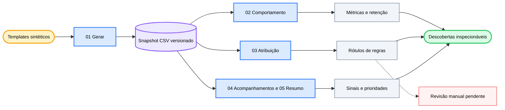

<div align="center">

# 💬 AI Chat Analytics

### *Transforme eventos sintéticos de conversa em descobertas inspecionáveis sobre a qualidade do produto.*

[](LICENSE) [](notebooks/01_data_generation.ipynb) [](notebooks) [](#data-and-privacy) [](https://github.com/okht/ai-chat-analytics)

[](data/users.csv) [](data/conversations.csv) [](data/events.csv) [](#data-and-privacy)

<br>

<table>
<tr><td align="left">

📭 &nbsp;5.394 conversas silenciosas desaparecem quando a análise começa apenas pelos eventos.<br>
🔀 &nbsp;Novas tentativas e perguntas de acompanhamento têm significados diferentes em seis cenários de intenção.<br>
🔎 &nbsp;71,2% dos casos problemáticos rotulados por regras caem em uma única categoria residual de qualidade.

</td></tr>
</table>

### ✨ Conecte métricas de comportamento, atribuição por regras, sinais de acompanhamento e priorização a um único snapshot sintético versionado.

**Templates sintéticos → snapshot CSV versionado → análises de comportamento, atribuição e acompanhamento → prioridades de produto**

<br>

[📊 Snapshot](#snapshot) · [🧭 Trilhas de análise](#analysis-tracks) · [📈 Resultados](#results) · [🗺️ Fluxo](#workflow) · [🚀 Reproduzir](#reproduce) · [🔬 Metodologia](#methodology) · [🔐 Dados e privacidade](#data-and-privacy) · [🧪 Verificação](#verification) · [📁 Estrutura](#project-structure) · [📌 Limitações](#limitations) · [📝 Notas](#notes)

[**English**](README.md) · [**简体中文**](README_CN.md) · [**Español**](README_ES.md) · [**Deutsch**](README_DE.md) · [**日本語**](README_JA.md) · [**Русский**](README_RU.md) · [**Português**](README_PT.md) · [**한국어**](README_KO.md)

</div>

---

<a id="snapshot"></a>
## 📊 Snapshot

AI Chat Analytics é um exemplo de pesquisa com cinco notebooks para estudar sinais de produto em IA conversacional. O snapshot versionado é gerado a partir de templates fixos, com as sementes aleatórias do NumPy e do Python definidas como `42`.

| Conjunto de dados | Linhas | Escopo |
|---|---:|---|
| **Usuários** | 500 | IDs sintéticos anônimos em coortes intensivas, casuais e inativas |
| **Conversas** | 22.394 | Seis cenários de intenção pré-atribuídos entre 2025-03-01 e 2025-03-31 |
| **Eventos** | 19.952 | Curtida, descurtida, nova tentativa e acompanhamento |
| **Casos problemáticos** | 7.363 | Conversas cujo primeiro evento é descurtida ou nova tentativa |

O snapshot contém 5.394 conversas sem evento. Elas representam 24,1% de todas as conversas e permanecem no denominador.

---

<a id="analysis-tracks"></a>
## 🧭 Trilhas de análise

| Notebook | Pergunta | Método | Artefato atual |
|---|---|---|---|
| **01 · Geração de dados** | O que pode ser estudado sem dados privados de produto? | Templates com semente, coortes e probabilidades de eventos por cenário | Três arquivos CSV versionados |
| **02 · Análise de comportamento** | O que o primeiro comportamento observado revela? | Distribuição, tabelas cruzadas, atividade, retenção e tendências diárias | Código do notebook; sem saída de execução salva |
| **03 · Atribuição semântica** | Por que descurtidas e novas tentativas acontecem? | Regras de palavras-chave com cinco rótulos e coluna de revisão manual pendente | `output/bad_cases_for_labeling.csv` |
| **04 · Sinais de acompanhamento** | Quais acompanhamentos parecem corretivos? | Divisão por palavras-chave e comparação de cenários | Código do notebook; sem saída de execução salva |
| **05 · Resumo de descobertas** | Quais cenários parecem mais urgentes neste snapshot? | Métricas recalculadas e cartões de prioridade | Código do notebook; sem saída de execução salva |

O caminho opcional de atribuição por LLM no notebook 03 é um modelo não executado. O repositório versionado não contém rótulos gerados por LLM.

---

<a id="results"></a>
## 📈 Resultados do snapshot versionado

Os valores a seguir foram recalculados diretamente dos arquivos CSV versionados.

### Distribuição do primeiro evento

| Primeiro comportamento | Conversas | Proporção |
|---|---:|---:|
| **Curtida** | 5.302 | 23,7% |
| **Descurtida** | 3.165 | 14,1% |
| **Nova tentativa** | 4.198 | 18,7% |
| **Acompanhamento** | 4.335 | 19,4% |
| **Silêncio** | 5.394 | 24,1% |

### Visão por cenário

`Insatisfação = proporção de descurtidas + proporção de novas tentativas`, usando o primeiro evento de cada conversa.

| Cenário | Conversas | Insatisfação |
|---|---:|---:|
| **Geração de código** | 5.615 | 45,1% |
| **Análise de dados** | 2.264 | 39,4% |
| **Perguntas de conhecimento** | 5.602 | 39,3% |
| **Escrita criativa** | 3.325 | 25,7% |
| **Tradução** | 3.354 | 19,8% |
| **Conversa casual** | 2.234 | 9,8% |

### Atribuição por regras e acompanhamentos

| Descoberta | Valor | Limite de interpretação |
|---|---:|---|
| **Rótulo residual de qualidade** | 71,2% | A cobertura das regras é limitada; não representa uma taxa validada de causa raiz |
| **Incompatibilidade de formato** | 12,4% | Proporção atribuída por regras em 7.363 casos problemáticos |
| **Recusa** | 6,8% | Proporção atribuída por regras em 7.363 casos problemáticos |
| **Alucinação** | 6,7% | Proporção atribuída por regras em 7.363 casos problemáticos |
| **Acompanhamentos corretivos** | 40,2% | Proporção classificada por palavras-chave entre 4.335 acompanhamentos |
| **Proporção corretiva em conhecimento** | 63,5% | Resultado de palavras-chave específico do cenário |

Todas as 7.363 linhas têm um rótulo de regra. A coluna `attribution_manual` continua vazia em todas elas.

---

<a id="workflow"></a>
## 🗺️ Fluxo de trabalho



O notebook 05 lê os arquivos CSV versionados diretamente e recalcula o resumo. Ele não consome saídas salvas dos notebooks 02–04.

---

<a id="reproduce"></a>
## 🚀 Reproduzir

Clone o repositório e instale as dependências de forma explícita. O arquivo versionado `requirements.txt` está vazio atualmente.

```powershell
git clone https://github.com/okht/ai-chat-analytics.git
cd ai-chat-analytics

python -m venv .venv
# Activate the environment for your shell, then run:
python -m pip install pandas numpy plotly jupyter
```

Abra o Jupyter a partir do diretório `notebooks`, pois os notebooks usam caminhos relativos como `../data` e `../output`.

```powershell
cd notebooks
jupyter notebook
```

Execute os notebooks nesta ordem:

1. `01_data_generation.ipynb`
2. `02_behavior_analysis.ipynb`
3. `03_semantic_attribution_analysis.ipynb`
4. `04_follow_up_signal_analysis.ipynb`
5. `05_insights_summary.ipynb`

> 📌 Execute a sequência completa em um clone novo ao comparar resultados. O notebook 01 reescreve os arquivos versionados em `data/`, e o notebook 03 reescreve `output/bad_cases_for_labeling.csv`.

O caminho principal não exige chave da OpenAI. O notebook 03 também contém um modelo opcional e comentado de rotulagem por LLM; sua ativação requer SDK e credencial configurados separadamente.

---

<a id="methodology"></a>
## 🔬 Metodologia

| Etapa | Regra atual | Consequência |
|---|---|---|
| **Intenção** | Uma de seis intenções é atribuída durante a geração sintética | A precisão de um classificador de intenção está fora das evidências deste repositório |
| **Comportamento principal** | O evento mais cedo define o comportamento principal da conversa | Eventos posteriores são mantidos, mas não definem as taxas principais |
| **Silêncio** | Uma conversa sem evento é contada como silenciosa | Uma análise só de eventos omitiria 5.394 conversas |
| **Caso problemático** | O primeiro evento é descurtida ou nova tentativa | O conjunto versionado contém 7.363 conversas |
| **Insatisfação** | Proporção de descurtidas mais proporção de novas tentativas | É uma métrica diagnóstica definida pelo projeto |
| **Atribuição** | Regras ordenadas atribuem um de cinco rótulos | 71,2% chega ao rótulo residual de qualidade |
| **Tipo de acompanhamento** | Palavras corretivas separam acompanhamentos do padrão exploratório | A divisão reflete os modelos e regras deste snapshot |

Os rótulos de regras são pré-anotações para revisão. Eles não foram validados contra rótulos humanos nem contra um conjunto de referência gerado por LLM.

---

<a id="data-and-privacy"></a>
## 🔐 Dados e privacidade

| Arquivo | Campos | Papel nos dados públicos |
|---|---|---|
| **`data/users.csv`** | ID sintético, coorte e data de cadastro | Amostra anônima de usuários |
| **`data/conversations.csv`** | Conversa, usuário, sessão, tempo, intenção, consulta e resposta | Amostra de conversas gerada por templates |
| **`data/events.csv`** | Evento, conversa, tipo, tempo e texto de acompanhamento | Fluxo de eventos gerado por templates |
| **`output/bad_cases_for_labeling.csv`** | Caso problemático, rótulo de regra e rótulo manual vazio | Planilha de revisão criada pelo notebook 03 |

- Não são incluídos dados de usuários reais, identificadores de conta, e-mails ou logs privados de produto.
- Os IDs sintéticos não se conectam a contas do ChatGPT, Claude ou outros serviços.
- O caminho principal lê CSV locais e não faz solicitações de rede.
- O texto `sk-xxx` do notebook 03 é um marcador dentro de um modelo opcional não executado.
- A adaptação para dados reais requer uma revisão separada de privacidade, consentimento, retenção e acesso.

---

<a id="verification"></a>
## 🧪 Verificação

| Verificação | Evidência atual |
|---|---|
| **Sintaxe dos notebooks** | Todas as 29 células de código são analisadas como Python |
| **Estado de execução salvo** | O notebook 01 tem saídas salvas; os notebooks 02–05 não |
| **Chaves primárias** | IDs de usuário, conversa e evento são únicos |
| **Referências** | Todo usuário de conversa e toda conversa de evento são resolvidos |
| **Tempo dos eventos** | Nenhum evento antecede sua conversa |
| **Rótulos manuais** | 0 de 7.363 linhas concluídas |
| **Testes automatizados** | Nenhuma suíte de testes automatizados está incluída |

As tabelas de resultados deste README foram verificadas contra o snapshot CSV versionado. Elas não representam um benchmark de produção.

---

<a id="project-structure"></a>
## 📁 Estrutura do projeto

```text
ai-chat-analytics/
├── README.md
├── README_CN.md
├── README_ES.md
├── README_DE.md
├── README_JA.md
├── README_RU.md
├── README_PT.md
├── README_KO.md
├── LICENSE
├── requirements.txt                  # currently empty
├── data/
│   ├── users.csv
│   ├── conversations.csv
│   └── events.csv
├── notebooks/
│   ├── 01_data_generation.ipynb
│   ├── 02_behavior_analysis.ipynb
│   ├── 03_semantic_attribution_analysis.ipynb
│   ├── 04_follow_up_signal_analysis.ipynb
│   └── 05_insights_summary.ipynb
├── output/
│   └── bad_cases_for_labeling.csv
└── src/
    └── utils.py                      # currently empty
```

---

<a id="limitations"></a>
## 📌 Limitações

- Todas as linhas versionadas são sintéticas; o comportamento de usuários reais pode diferir de forma relevante.
- As intenções são atribuídas durante a geração e não avaliam um classificador.
- As versões das dependências não estão fixadas, e `requirements.txt` está vazio.
- `src/utils.py` está vazio; o código de análise ativo está nos notebooks.
- Os notebooks 02–05 não têm saídas de execução salvas no snapshot versionado.
- A coluna de rótulos manuais está vazia, portanto a precisão da atribuição por regras é desconhecida.
- O caminho opcional de LLM é um modelo não executado, sem resultado versionado.
- Não são incluídos testes automatizados, fluxo de CI, Release ou matriz de compatibilidade.

---

<a id="notes"></a>
## 📝 Notas

Use as descobertas versionadas como um exemplo inspecionável de construção de métricas e limites analíticos. Revalide cada hipótese antes de adaptar o fluxo a outro conjunto de dados.

Issues e pull requests são bem-vindos.

---

<div align="center">

**Mantenha cada recomendação de produto rastreável aos seus dados e pressupostos.**

<br>

Licença MIT · Mantido por [okht](https://github.com/okht)

</div>
