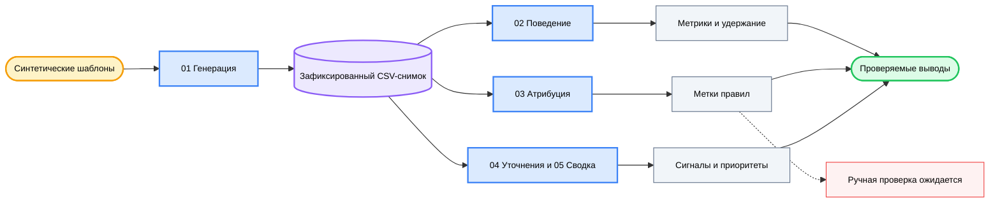

<div align="center">

# 💬 AI Chat Analytics

### *Превратите синтетические события диалогов в проверяемые выводы о качестве продукта.*

[](LICENSE) [](notebooks/01_data_generation.ipynb) [](notebooks) [](#data-and-privacy) [](https://github.com/okht/ai-chat-analytics)

[](data/users.csv) [](data/conversations.csv) [](data/events.csv) [](#data-and-privacy)

<br>

<table>
<tr><td align="left">

📭 &nbsp;5 394 молчаливых диалога исчезают, если анализ начинается только с таблицы событий.<br>
🔀 &nbsp;Повторные попытки и уточнения несут разный смысл в шести сценариях намерения.<br>
🔎 &nbsp;71,2% проблемных случаев с метками правил попадают в одну остаточную категорию качества.

</td></tr>
</table>

### ✨ Свяжите поведенческие метрики, атрибуцию по правилам, сигналы уточнений и приоритеты с одним зафиксированным синтетическим снимком.

**Синтетические шаблоны → зафиксированный CSV-снимок → анализ поведения, атрибуции и уточнений → продуктовые приоритеты**

<br>

[📊 Снимок](#snapshot) · [🧭 Направления анализа](#analysis-tracks) · [📈 Результаты](#results) · [🗺️ Процесс](#workflow) · [🚀 Воспроизведение](#reproduce) · [🔬 Методология](#methodology) · [🔐 Данные и приватность](#data-and-privacy) · [🧪 Проверка](#verification) · [📁 Структура](#project-structure) · [📌 Ограничения](#limitations) · [📝 Примечания](#notes)

[**English**](README.md) · [**简体中文**](README_CN.md) · [**Español**](README_ES.md) · [**Deutsch**](README_DE.md) · [**日本語**](README_JA.md) · [**Русский**](README_RU.md) · [**Português**](README_PT.md) · [**한국어**](README_KO.md)

</div>

---

<a id="snapshot"></a>
## 📊 Снимок

AI Chat Analytics — исследовательский пример из пяти Notebook для изучения продуктовых сигналов разговорного ИИ. Зафиксированный снимок создаётся из постоянных шаблонов; генераторы случайных чисел NumPy и Python используют seed `42`.

| Набор данных | Строки | Охват |
|---|---:|---|
| **Пользователи** | 500 | Анонимные синтетические ID в активной, обычной и ушедшей когортах |
| **Диалоги** | 22 394 | Шесть заранее назначенных сценариев намерения с 2025-03-01 по 2025-03-31 |
| **События** | 19 952 | Like, dislike, retry и follow-up |
| **Проблемные случаи** | 7 363 | Диалоги, где первое событие — dislike или retry |

В снимке есть 5 394 диалога без событий. Они составляют 24,1% всех диалогов и остаются в знаменателе.

---

<a id="analysis-tracks"></a>
## 🧭 Направления анализа

| Notebook | Вопрос | Метод | Текущий артефакт |
|---|---|---|---|
| **01 · Генерация данных** | Что можно исследовать без закрытых продуктовых данных? | Шаблоны с seed, когорты и вероятности событий по сценариям | Три зафиксированных CSV-файла |
| **02 · Анализ поведения** | Что показывает первое наблюдаемое действие? | Распределение событий, кросс-таблицы сценариев, активность, удержание и дневные тренды | Код Notebook; сохранённого результата выполнения нет |
| **03 · Семантическая атрибуция** | Почему возникают dislike и retry? | Пять меток по ключевым словам и ожидающая ручной проверки колонка | `output/bad_cases_for_labeling.csv` |
| **04 · Сигналы уточнений** | Какие уточнения выглядят корректирующими? | Разделение по ключевым словам и сравнение сценариев | Код Notebook; сохранённого результата выполнения нет |
| **05 · Сводка выводов** | Какие сценарии выглядят наиболее срочными в этом снимке? | Пересчёт метрик и карточки приоритетов | Код Notebook; сохранённого результата выполнения нет |

Необязательный путь LLM-атрибуции в Notebook 03 — невыполненный шаблон. В зафиксированном репозитории нет меток, созданных LLM.

---

<a id="results"></a>
## 📈 Результаты зафиксированного снимка

Следующие значения пересчитаны напрямую из зафиксированных CSV-файлов.

### Распределение первого события

| Первое действие | Диалоги | Доля |
|---|---:|---:|
| **Like** | 5 302 | 23,7% |
| **Dislike** | 3 165 | 14,1% |
| **Retry** | 4 198 | 18,7% |
| **Уточнение** | 4 335 | 19,4% |
| **Молчание** | 5 394 | 24,1% |

### Сценарии

`Неудовлетворённость = доля dislike + доля retry`, используется первое событие каждого диалога.

| Сценарий | Диалоги | Неудовлетворённость |
|---|---:|---:|
| **Генерация кода** | 5 615 | 45,1% |
| **Анализ данных** | 2 264 | 39,4% |
| **Вопросы по знаниям** | 5 602 | 39,3% |
| **Творческое письмо** | 3 325 | 25,7% |
| **Перевод** | 3 354 | 19,8% |
| **Неформальный диалог** | 2 234 | 9,8% |

### Атрибуция по правилам и уточнения

| Вывод | Значение | Граница интерпретации |
|---|---:|---|
| **Остаточная метка качества** | 71,2% | Покрытие правил ограничено; это не проверенная частота первопричины |
| **Несовпадение формата** | 12,4% | Доля, назначенная правилами среди 7 363 проблемных случаев |
| **Отказ** | 6,8% | Доля, назначенная правилами среди 7 363 проблемных случаев |
| **Галлюцинация** | 6,7% | Доля, назначенная правилами среди 7 363 проблемных случаев |
| **Корректирующие уточнения** | 40,2% | Доля, классифицированная по ключевым словам среди 4 335 уточнений |
| **Корректирующая доля в вопросах по знаниям** | 63,5% | Результат ключевых слов для этого сценария |

У всех 7 363 строк есть метка правила. Колонка `attribution_manual` остаётся пустой в каждой строке.

---

<a id="workflow"></a>
## 🗺️ Процесс



Notebook 05 читает зафиксированные CSV напрямую и пересчитывает сводку. Он не использует сохранённые выходы Notebook 02–04.

---

<a id="reproduce"></a>
## 🚀 Воспроизведение

Клонируйте репозиторий и установите зависимости явно. Отслеживаемый `requirements.txt` сейчас пуст.

```powershell
git clone https://github.com/okht/ai-chat-analytics.git
cd ai-chat-analytics

python -m venv .venv
# Activate the environment for your shell, then run:
python -m pip install pandas numpy plotly jupyter
```

Открывайте Jupyter из каталога `notebooks`, потому что Notebook используют относительные пути `../data` и `../output`.

```powershell
cd notebooks
jupyter notebook
```

Запускайте Notebook в следующем порядке:

1. `01_data_generation.ipynb`
2. `02_behavior_analysis.ipynb`
3. `03_semantic_attribution_analysis.ipynb`
4. `04_follow_up_signal_analysis.ipynb`
5. `05_insights_summary.ipynb`

> 📌 Для сравнения результатов запускайте всю последовательность в свежем клоне. Notebook 01 перезаписывает зафиксированные файлы в `data/`, а Notebook 03 — `output/bad_cases_for_labeling.csv`.

Основной путь не требует ключа OpenAI. В Notebook 03 также есть закомментированный необязательный шаблон LLM-разметки; для его включения SDK и учётные данные настраиваются отдельно.

---

<a id="methodology"></a>
## 🔬 Методология

| Этап | Текущее правило | Следствие |
|---|---|---|
| **Намерение** | Одна из шести меток назначается при синтетической генерации | Точность классификатора намерений не входит в доказательную базу репозитория |
| **Основное действие** | Самое раннее событие становится основным действием диалога | Более поздние события сохраняются, но не определяют основные доли |
| **Молчание** | Диалог без событий считается молчаливым | Анализ только событий пропустил бы 5 394 диалога |
| **Проблемный случай** | Первое событие — dislike или retry | Зафиксированный набор содержит 7 363 диалога |
| **Неудовлетворённость** | Доля dislike плюс доля retry | Это диагностическая метрика проекта |
| **Атрибуция** | Упорядоченные правила назначают одну из пяти меток | 71,2% попадает в остаточную метку качества |
| **Тип уточнения** | Корректирующие ключевые слова отделяют уточнения от исследовательского значения по умолчанию | Разделение отражает шаблоны и правила снимка |

Метки правил служат предварительной разметкой для проверки. Их не сверяли с человеческими метками или эталонным набором, созданным LLM.

---

<a id="data-and-privacy"></a>
## 🔐 Данные и приватность

| Файл | Поля | Роль в публичных данных |
|---|---|---|
| **`data/users.csv`** | Синтетический ID, когорта, дата регистрации | Анонимный набор пользователей |
| **`data/conversations.csv`** | Диалог, пользователь, сессия, время, намерение, запрос, ответ | Набор диалогов из шаблонов |
| **`data/events.csv`** | Событие, диалог, тип, время, текст уточнения | Поток событий из шаблонов |
| **`output/bad_cases_for_labeling.csv`** | Проблемный случай, метка правила, пустая ручная метка | Лист проверки из Notebook 03 |

- Реальные пользовательские данные, ID аккаунтов, электронная почта и закрытые продуктовые логи не включены.
- Синтетические ID не связаны с аккаунтами ChatGPT, Claude или других сервисов.
- Основной путь читает локальные CSV и не отправляет сетевые запросы.
- `sk-xxx` в Notebook 03 — заполнитель внутри невыполненного необязательного шаблона.
- Перед применением к реальным данным отдельно проверяются приватность, согласие, сроки хранения и контроль доступа.

---

<a id="verification"></a>
## 🧪 Проверка

| Проверка | Текущее подтверждение |
|---|---|
| **Синтаксис Notebook** | Все 29 ячеек кода разбираются как Python |
| **Сохранённое состояние выполнения** | В Notebook 01 есть сохранённые выходы; в Notebook 02–05 их нет |
| **Первичные ключи** | ID пользователей, диалогов и событий уникальны |
| **Ссылки** | Каждый пользователь диалога и каждый диалог события разрешается |
| **Время события** | Ни одно событие не предшествует своему диалогу |
| **Ручные метки** | Завершено 0 из 7 363 строк |
| **Автоматические тесты** | Набор автоматических тестов не включён |

Таблицы результатов в этом README сверены с зафиксированным CSV-снимком. Они не являются производственным бенчмарком.

---

<a id="project-structure"></a>
## 📁 Структура проекта

```text
ai-chat-analytics/
├── README.md
├── README_CN.md
├── README_ES.md
├── README_DE.md
├── README_JA.md
├── README_RU.md
├── README_PT.md
├── README_KO.md
├── LICENSE
├── requirements.txt                  # currently empty
├── data/
│   ├── users.csv
│   ├── conversations.csv
│   └── events.csv
├── notebooks/
│   ├── 01_data_generation.ipynb
│   ├── 02_behavior_analysis.ipynb
│   ├── 03_semantic_attribution_analysis.ipynb
│   ├── 04_follow_up_signal_analysis.ipynb
│   └── 05_insights_summary.ipynb
├── output/
│   └── bad_cases_for_labeling.csv
└── src/
    └── utils.py                      # currently empty
```

---

<a id="limitations"></a>
## 📌 Ограничения

- Все зафиксированные строки синтетические; реальное поведение пользователей может существенно отличаться.
- Метки намерений назначаются при генерации данных и не оценивают классификатор.
- Версии зависимостей не закреплены, а `requirements.txt` пуст.
- `src/utils.py` пуст; рабочий код анализа находится в Notebook.
- В зафиксированном снимке Notebook 02–05 нет сохранённых результатов выполнения.
- Колонка ручных меток пуста, поэтому точность атрибуции по правилам неизвестна.
- Необязательный путь LLM — невыполненный шаблон без зафиксированного результата.
- Автоматические тесты, CI-процесс, Release и матрица совместимости не включены.

---

<a id="notes"></a>
## 📝 Примечания

Используйте зафиксированные выводы как проверяемый пример построения метрик и границ анализа. Перепроверяйте каждое допущение перед переносом процесса на другой набор данных.

Issues и pull requests приветствуются.

---

<div align="center">

**Сохраняйте связь каждой продуктовой рекомендации с её данными и допущениями.**

<br>

Лицензия MIT · Поддерживает [okht](https://github.com/okht)

</div>
